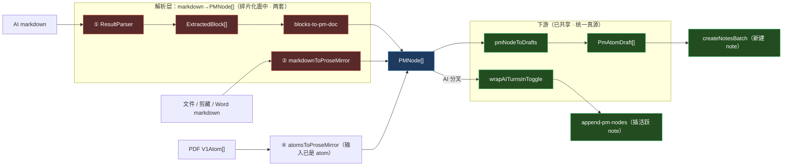
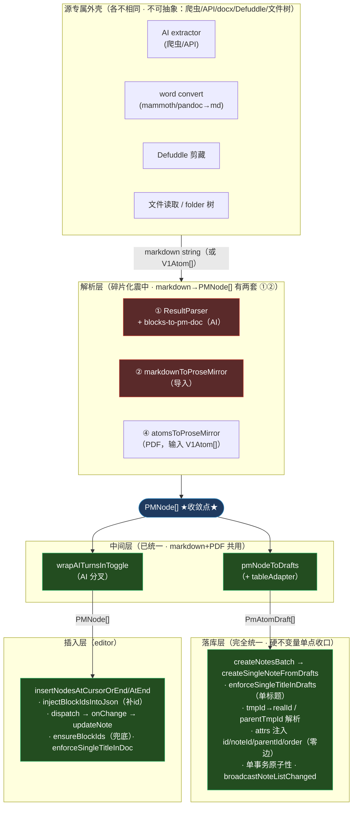
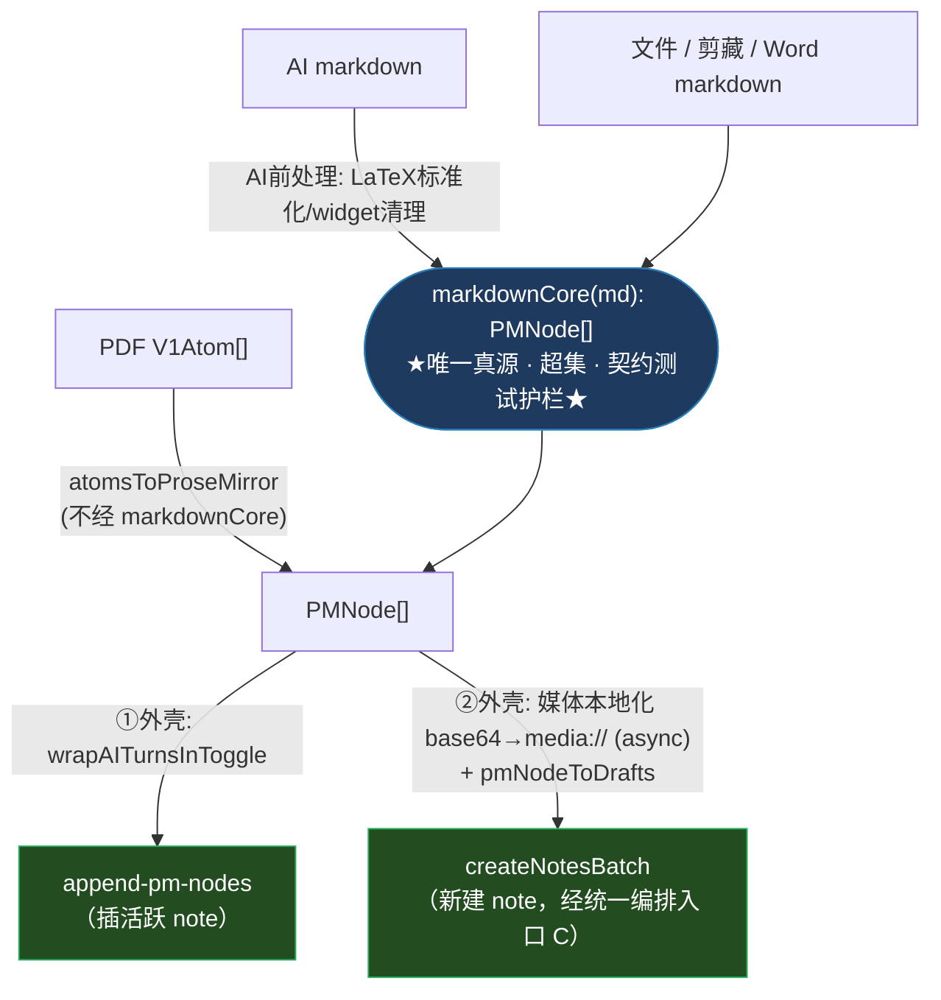

# 「导入到 Note」路径 — 调研、数据流与收敛实施方案

> **立项动机**（2026-07-25，总指挥拍板）：代码块解析 bug 先在 **AI 提取**路径被发现并修复，随后调研证实**同一个 bug 在 Markdown 导入 / 网页剪藏路径原封不动地存在**——因为它们各用一套独立的 markdown→PM 转换器。这是「同一问题在不同导入路径反复复发」的活证据。
>
> 本文合并原「调研与统一方案」+「B/C/D 详细设计」两份，补齐**数据形态流转、函数抽象边界、异步分层、逐步迁移动作**，达到「可照着实现」的粒度。
>
> **调研方法**：多个并行 Explore agent（入口分布 / 转换器逐 block 差异 / 消费方与落库路径 / 写库约束）+ 实战定位。
>
> **状态**：阶段 A 已完成并合入。B/C/D 为**待审设计**，未动代码。
>
> **关联规范**：统一后的 markdown 中间语言由 [[krig-markdown-dialect-spec]]（KRIG Markdown 方言规范）定义——B 阶段抽的 `markdownCore` 就是这份方言的解析器。方言把「非标准 block 如何用 markdown 表达 + 优雅降级」定死，是「所有入口只管产标准 markdown」的语法契约。

---

# 第一部分：现状调研

## 1. 需求清单：所有「内容 → Note」的入口

| # | 来源 | 触发/入口 | 解析链路 | 落库语义 |
|---|------|-----------|----------|----------|
| 1 | **AI 整页提取** | `ai-view.extract-conversation`（`ai-commands.ts:71`） | extractor→markdown → `aiMarkdownToNoteDoc`（①）→ `wrapAITurnsInToggle` → PMNode[] | **`append-pm-nodes`**（插活跃 note）/ fallback 建 Thought |
| 2 | **AI 单条提取** | `ai-view.extract-turn`（`ai-commands.ts:187`） | 同上 | **`append-pm-nodes`**（右槽须是 note） |
| 3 | **ai-sync** | `note-commands.ts:367` append-ai-turn | 单 turn → PMNode[] | **`append-pm-nodes`** |
| 4 | **Markdown 文件** | `markdown-import.ts:727/658` | markdown → `markdownToAtoms`（③=②+pmNodeToDrafts）→ PmAtomDraft[] | **`createNotesBatch`**（多篇，可跨 folder） |
| 5 | **Word (docx)** | `word-import/index.ts` | docx→markdown → 同 #4 | **`createNotesBatch`** |
| 6 | **网页剪藏** | `import-pipeline.ts:280/406` | Defuddle→markdown→`sanitizeDefuddleMarkdown`→`markdownToAtoms` | **`createNotesBatch`**（单篇，根级） |
| 7 | **PDF / eBook** | `extraction-import.ts:81/134` | KRIG batch → `krigBatchToAtoms`（④ atoms-to-pm + pmNodeToDrafts）→ PmAtomDraft[] | **`createNotesBatch`**（多篇，同 folder） |
| 8 | 编辑器内新建/粘贴/拖拽 | `createNote` / PM tx | 经 `auto-block-id-plugin` | `createNote` / editor tx |

**两条落库语义（关键，不可互换）**：
- **`createNotesBatch`**（`capability-impl.ts:959`）：**新建** note，吃 `PmAtomDraft[]`，单事务、≤500 篇。来源 #4~#7。
- **`note-view.append-pm-nodes`**（`note-commands.ts:399` → driver `insertNodesAtCursorOrEnd`）：往**已打开**的活跃 note **增量插入** PM 节点。来源 #1~#3。

## 2. 转换器分布：5 套独立实现

| # | 转换器 | 入口（file:line） | 输入 → 输出 | 落库去向 |
|---|--------|-------------------|-------------|----------|
| ① | **AI Markdown Parser** | `ai-markdown-parser/result-parser.ts:23` + `blocks-to-pm-doc.ts:69` | markdown → **ExtractedBlock[]** → PMNode[] | append-pm-nodes |
| ② | **通用 Markdown→PM** | `text-editing/converters/md-to-pm.ts:116` | markdown → **PMNode[]**（async） | (→③) |
| ③ | **Markdown→Atoms** | `content-ingest/internal/markdown-to-atoms.ts:46` | markdown →(②)→ PMNode[] →(pmNodeToDrafts)→ **PmAtomDraft[]** | createNotesBatch |
| ④ | **Atoms→PM** | `text-editing/converters/atoms-to-pm.ts:542` | V1Atom[] → **PMNode[]** →(pmNodeToDrafts)→ PmAtomDraft[] | createNotesBatch |
| ⑤ | **Web 剪藏链** | `content-extraction/sanitize.ts:12` →(③) | HTML→markdown → PmAtomDraft[] | createNotesBatch |

**关键结构洞察（决定整个收敛设计）**：
- **`PMNode[]` 已经是天然收敛点**。② 和 ④ 都产 PMNode[]，且**都喂给同一个 `pmNodeToDrafts`**（`content-ingest/internal/pm-nodes-to-drafts.ts:33`，注释明说「markdown + PDF 共用」）→ PmAtomDraft[]。这一段**已经收敛**。
- **只有 ①（ResultParser）游离在外**：它产 `ExtractedBlock[]` 中间态（额外一层），经 `extractedBlocksToPmDoc` 转 PMNode[]，且走 append-pm-nodes 而非 pmNodeToDrafts。
- 所以碎片化的真正震中是**「markdown string → PMNode[]」这一段有两套**（① 的 `ResultParser+blocks-to-pm-doc`、② 的 `markdownToProseMirror`），下游（PMNode[]→drafts→落库）其实已统一。

现状数据流（谁产 `PMNode[]`，之后怎么走）：



- 🔴 **红色 = 碎片化震中**：`markdown → PMNode[]` 有两套（① `ResultParser`+`blocks-to-pm-doc`、② `markdownToProseMirror`）。
- 🔵 **蓝色 = 唯一收敛点** `PMNode[]`。
- 🟢 **绿色 = 已共享/统一**：`pmNodeToDrafts` → `PmAtomDraft[]` → `createNotesBatch`（下游早已统一）；`wrapAITurnsInToggle` → `append-pm-nodes` 是 AI 侧另一落库语义分叉。
- ④ `atomsToProseMirror` 输入是 V1Atom[] 非 markdown，不属两套 markdown 解析，但同样汇入 `PMNode[]`。

## 3. 核心问题：同一 bug 跨路径复发（已证实）

**代码块嵌套 fence 配对 bug**：ChatGPT 把整段回复包成外层 ` ```` ` `markdown 里再套 ` ``` ` `mermaid，转换器逐行找闭栏若不按 fence 长度配对，内层 ` ``` ` 被误当闭栏 → 空 codeBlock + 内容漏成正文。
- ① 已修（`result-parser.ts:472+`，按开栏长度配对）。
- ② 阶段 A 已修（`md-to-pm.ts` 同法）。
- **但两套是各修各的** —— 下次别的 block 类型（表格/mark/list…）出 bug，仍会在 ①② 各犯一次。**根治要 B（抽共享核）**。

**其它隐患**：② 表格「零单元格行静默跳过」无留痕（阶段 D）；schema 校验（`PMNode.fromJSON()`）只拦结构错，拦不住语义解析错（fence bug 就这样溜过）。

## 4. 两套转换器逐 block 差异矩阵

**谁都不是超集**（合并 = 并成超集，不是删一套）：

| Block / 能力 | ① ResultParser | ② md-to-pm | 备注 |
|---|:---:|:---:|---|
| heading / paragraph / hr | ✅ | ✅ | 输出一致 |
| **代码块·嵌套 fence** | ✅ | ✅(A修) | 均已修 |
| code title | ✅ `codeTitle` | ❌ | ① blocks-to-pm-doc 目前也丢弃 |
| math 块 + 行内 | ✅ +LaTeX标准化 | ✅ | ① 多 ChatGPT 清理 |
| **callout** | ✅ GitHub`[!X]`+HTML+emoji | ❌ | ② 当普通 blockquote |
| blockquote | ✅ inline | ✅ **递归内嵌块** | ② 引用内可含 heading/list |
| **List 内嵌 block** | ✅ 列表项含 code/math/img/table | ❌ 仅单行 inline | 差异大 |
| **task list** `[x]` | ❌ | ✅ +createdAt | |
| table | ✅ | ✅ **零行过滤 + cell`<br>`拆段** | ② 更 robust |
| image | ✅ **3格式+bbox**（PDF重定位） | ✅ **base64→media://** | 各有独有 |
| video / audio / htmlBlock | ✅ | ❌ | ② 降级为占位 |
| **mark 递归嵌套** `**[x](u)**` | ❌ flat 正则 | ✅ applyMark 递归 | |
| **删除线** `~~` | ❌ | ✅ | |
| 段落内嵌图片拆分 | ✅ splitParagraph | ❌ 需分行 | |

**真实数据形态对比**（同一段 markdown 两套产什么）：

```
输入： ## 标题\n\n> [!WARNING] 小心\n\n- 列表项\n  ```py\n  code\n  ```

① ResultParser → ExtractedBlock[]:
  [{ type:'heading', tag:'h2', text:'标题', headingLevel:2, inlines:[...] },
   { type:'callout', calloutType:'warning', calloutEmoji:'⚠️', text:'小心', inlines:[...] },
   { type:'bulletList', items:[{ text:'列表项', blocks:[{type:'code',language:'py',text:'code'}] }] }]
  ─ 再经 blocks-to-pm-doc → PMNode[]（callout→{type:'callout',attrs:{emoji}}，list item 内嵌 codeBlock）

② markdownToProseMirror → PMNode[]（直接）:
  [{ type:'heading', attrs:{level:2}, content:[{type:'text',text:'标题'}] },
   { type:'blockquote', content:[{type:'paragraph',...}] },   // ← callout 丢了，降级普通引用
   { type:'bulletList', content:[{type:'listItem',content:[{type:'paragraph',...}]}] }]  // ← 内嵌 code 丢了
```

## 5. 写库真源与硬约束（收敛必须遵守的地基）

**写入 API（3 个）**：
- `createNote(initialDoc, folderId)`（`capability-impl.ts:227`）：单篇，吃 PM doc envelope。
- `createNotesBatch(items)`（`capability-impl.ts:959`）：批量，吃 `PmAtomDraft[]`，单事务、≤500 篇。**批量导入主入口**。
- `note-view.append-pm-nodes`（`note-commands.ts:399`）：往已开 note 插 PMNode[]。

**硬约束（都已在写库必经处收口，收敛不得绕过）**：
1. **block 必须带 attrs.id**。4 处注入：`auto-block-id-plugin`（编辑器 tx）/ `injectIdsForCreate`（createNote）/ `ensureBlockIds`（updateNote 兜底）/ `injectBlockIdsIntoJson`（driver 插入前）。`[[project-imported-note-idless-autosave]]`
2. **至多一个 isTitle 首块**：`enforce-single-title.ts`，updateNote + createNotesBatch 双路收口。`[[project-note-single-title-invariant]]`
3. **dissect 拒空 id / 重复 id**：fail loud。

**content-ingest 边界铁律**（`content-ingest/types.ts:7-9`）：**只转换、不落库、不导 PM 形态、不调 noteCap**。→ 统一编排入口**不能**塞进 content-ingest 内部（见 C）。

**关键数据形态**（实现时对照）：
```ts
// PmAtomDraft（@semantic/types/pm-atom-draft.ts）—— 批量导入中间态
interface PmAtomDraft {
  tmpId: string;              // 'tmp-0'…，本数组内唯一，storage 写入后丢弃
  parentTmpId?: string;      // 表达 childOf，storage 改写为 realId
  payload: Atom<'pm'>;       // { domain:'pm', payload: PmPayload }
  from?: { extractionType?, pdfPage?, extractedAt? };
}
// pmNodeToDrafts(pmNode, parentTmpId, out, allocTmpId, from)：PMNode[] → PmAtomDraft[]
//   跳过 STRUCTURAL_CONTAINER_TYPES（table/tableRow/3种list容器/columnList），children 提到父级
//   非结构块分配 tmpId 产 draft；叶子 content=inline 原样，容器 content=[]
```

---

## 6. 函数级流水线与抽象分层（实现依据）

> 逐函数深挖（8 条路径 50+ 函数）的综合。每条路径一张流水线（函数│输入→输出│职责│副作用│纯逻辑or专属）。**「纯逻辑」= 无副作用可复用 → 收敛候选；「专属」= 带 IPC/落库/editor/dialog 副作用或路径独有编排 → 留外壳。** 抽象边界从这些真实职责推出。

### 6.0 全局分层总图（所有路径的汇聚真相）



**三条铁律级结论**：
1. **PMNode[] 是唯一天然收敛点**。它上游有两套解析（①②），它下游（pmNodeToDrafts→落库）**已完全统一**。B 只需收敛「→PMNode[]」这一段。
2. **落库层已是所有 batch 路径的单点不变量收口**（`createSingleNoteFromDrafts`：单标题/id/tmpId映射/属性注入/事务/广播）。C **不动落库层内部**，只收敛它**外面**那圈重复的「调 batch + 进度 + 结果归一」编排。
3. **两条落库语义天然分工**：batch（新建，走 PmAtomDraft[]）vs insert（插活跃 note，走 PMNode[]）。各自的 id 补齐时机不同（batch 侧 createSingleNoteFromDrafts 注入 realId；insert 侧 injectBlockIdsIntoJson 提前补真 id 防 race）。不可互换。

### 6.1 AI 提取三条路径（#1 整页 / #2 单条 / #3 ai-sync）

| 步 | 函数（file:line） | 输入→输出 | 职责/事务 | 副作用 | 判定 |
|---|---|---|---|---|---|
| 1 | `extract-conversation`/`extract-turn` 命令（ai-commands.ts:71/193） | ctx→void | 主入口，按 slot 分流（右槽 Note→insert / 否则 Thought） | IPC/dispatch/alert/broadcast | 专属 |
| 2 | `extractFull`/`extractTurn`→`extractFullConversation`（ask-orchestrator.ts:222） | serviceId,wcId→{markdown} | 按服务分流 extractor | IPC | 专属 |
| 3 | `extractChatGPTFullConversation`/`loadChatGPTConversation`（chatgpt-full-extraction.ts:583/452） | wc→markdown | 页内 fetch 对话树→拼 `## 👤/🤖` markdown | JS注入/网络 | 专属（爬虫，无法抽象） |
| 4 | **`aiMarkdownToNoteDoc`**（ai-markdown-parser/index.ts:27） | markdown→NoteDocEnvelope | =`ResultParser.parse`+`extractedBlocksToPmDoc` | 无 | **纯逻辑（①解析核）** |
| 5 | **`wrapAITurnsInToggle`**（wrap-ai-turns.ts:93） | PMNode[],name→PMNode[] | 按 emoji heading 切轮→❓callout+🔀toggle+hr | 无 | **纯逻辑** |
| 5' | **`buildAITurnPmNodes`**（ai-sync-blocks.ts:36，仅#3） | turn→PMNode[] | 单轮固定模板（内部**也调 ResultParser.parse**） | 无 | **纯逻辑** |
| 6 | `append-pm-nodes`→`insertNodesAtCursorOrEnd`（api.ts:2142） | PMNode[]→bool | 定位光标/末尾→插入 | dispatch/落库/滚动 | 专属（持 EditorView） |
| 6a | `injectBlockIdsIntoJson`（api.ts:84） | JSON→JSON | 插入前补真 ULID（防 dissect race） | 无 | **纯逻辑** |
| — | fallback `createThought`/`updateThought`（thought/types.ts） | doc→ThoughtInfo | 无 Note 时建卡片 | 落库/广播 | 专属 |

**AI 侧小结**：纯逻辑核 = `ResultParser.parse`+`extractedBlocksToPmDoc`（①解析）+`wrapAITurnsInToggle`/`buildAITurnPmNodes`（AI 节点重组）+`injectBlockIdsIntoJson`。专属外壳 = extractor（爬虫/API）、命令入口（slot 判断）、insert（editor）、Thought 落库。**注意 `buildAITurnPmNodes` 内部已复用 ① 解析核** → AI 三路径解析已自洽，只是与 ② 各一套。

### 6.2 Markdown / Word / 剪藏（#4 / #5 / #6）

| 步 | 函数（file:line） | 输入→输出 | 职责/事务 | 副作用 | 判定 |
|---|---|---|---|---|---|
| **#4 Markdown 文件** |
| 1 | `importMarkdownBatch`（markdown-import.ts:472） | files→ImportResult | 全链路编排：oversized判定/分割确认/folder树/逐块转/末尾batch | IPC/进度overlay/落盘/folder创建/去重 | 专属 |
| 1a | `parseHeadings`/`estimateTextCharCount`/`splitByMaxLevel`（:144/94/173） | md→结构 | 扫标题/算字符数(剥base64)/按最大level切片 | 无 | **纯逻辑** |
| 1b | `buildFolderTreeCache`/`ensureFolderPath`/`ensureSplitDocFolder`（:299/377/429） | segs→folderId | folder 树建/去重 | IPC(list/create folder) | 专属 |
| 2 | **`markdownToAtoms`**（markdown-to-atoms.ts:46） | md→{atoms,warnings} | =`markdownToProseMirror`+遍历`pmNodeToDrafts`+titleHint | 无(内部媒体本地化async) | **纯逻辑（收敛核心）** |
| 2a | **`markdownToProseMirror`**（md-to-pm.ts:116） | md→PMNode[]（async） | ②解析：行级状态机+`parseInline`+媒体本地化 | IPC(mediaPutBase64) | **纯逻辑+媒体I/O分层** |
| 2b | `parseInline`（md-to-pm.ts:494） | text→PMNode[] | 行内 mark **递归嵌套**+strike+link+math | 无 | **纯逻辑** |
| 2c | `resolvePMImageSrc`/`resolvePMAttachmentSrc`（:545/561） | src→media:// | base64→media://（**async I/O**） | IPC | **转接层（分层点）** |
| 2d | **`pmNodeToDrafts`**/`tableAdapter`（pm-nodes-to-drafts.ts:33 / table-adapter.ts:86） | PMNode→PmAtomDraft[] | 递归拆解：结构容器跳层/table展开/叶子vs容器 | 无 | **纯逻辑（markdown+PDF 共用）** |
| 3 | `createNotesBatch`（capability-impl.ts:771 调用） | items→result | 落库（见 6.3） | 事务/广播 | 专属（落库层） |
| **#5 Word** |
| 1 | `runImportMammoth`/`runImportPandoc`（word-import/index.ts:172/254） | →void | 菜单入口：dialog/转换/落盘/广播 | dialog/进度/import-cache/IPC | 专属 |
| 2 | `convertDocxToMarkdown`(mammoth)/`convertDocxToMarkdownPandoc`（converter*.ts） | docx→md | docx→HTML/md（styleMap/spawn/后处理） | 文件I/O/spawn/临时文件 | 专属（源转换） |
| 2a | `splitImageWithTrailingText`/`normalizeGfmMathSyntax`/`extractCoverTitle`（md-postprocess/converter*） | md→md | 图拆行/数学方言/标题抽取 | 无 | **纯逻辑** |
| 3 | →广播 `MARKDOWN_IMPORT_RUN`→renderer 走 **#4** | | Word 无独立落库，接力到 #4 | IPC | 专属 |
| **#6 网页剪藏** |
| 1 | `runImportPipelineInner`（import-pipeline.ts:234） | WebClipPayload→void | 5阶段：规整md/正文atoms/补媒体block/batch/开note | 媒体下载/IPC/命令 | 专属 |
| 1a | `dedupeConsecutiveLines`/`joinSplitLinkedImages`/`isolateInlineImages`/`stripRedundantImageAlt`（import-pipeline.ts） | md→md | Defuddle markdown 规整链 | 无 | **纯逻辑（剪藏特化）** |
| 1b | `sanitizeDefuddleMarkdown`（sanitize.ts:12） | md→md | 清 HTML 噪音（含代码块语言修复） | 无 | **纯逻辑（剪藏特化）** |
| 1c | `localizeInlineImages`/`localizeImage`/`localizeAudio`（import-pipeline.ts） | url→media:// | 远程媒体 mediaDownload | IPC | 专属（媒体I/O） |
| 2 | `markdownToAtoms`（复用 #4 步2） | md→atoms | 正文转 drafts | — | **纯逻辑** |
| 3 | `buildImageBlockDraft`/`buildVideoBlockDrafts`/`buildAudioBlockDrafts`（draft-builders.ts） | input→PmAtomDraft[] | 媒体 block→draft（schema-aware：video/audio 必带 caption 子 draft） | 无 | **纯逻辑（schema-aware）** |
| 4 | `createNotesBatch`（:406）+`set-active-in-right` | items→void | 单篇落库+打开 | 事务/广播/命令 | 专属 |

### 6.3 落库层核心（#7 PDF + 所有 batch 汇聚点，最详细）

| 步 | 函数（file:line） | 输入→输出 | 职责/事务 | 判定 |
|---|---|---|---|---|
| #7-1 | `importExtractionBatch`（extraction-import.ts:67） | KrigBatch→ImportResult | PDF 顶层：folder/去重/进度/batch | 专属 |
| #7-2 | `krigBatchToAtoms`→`processChapter`（krig-batch-to-atoms.ts:41/66） | batch→章节×drafts | 每章：拼raw atom+sanitize+`atomsToProseMirror`+`pmNodeToDrafts` | 纯逻辑+媒体 |
| #7-3 | `atomsToProseMirror`（atoms-to-pm.ts:542，④） | V1Atom[]→PMNode[] | 13种atom type映射+list树重建+id占位 | 纯逻辑+媒体I/O |
| **汇聚** | **`createNotesBatch`**（capability-impl.ts:959） | {items,broadcastMode}→{notes,failures} | 容量检查(≤500)+逐item+**单事务整体回滚**+final广播 | **专属（落库不变量）** |
| **汇聚** | **`createSingleNoteFromDrafts`**（:1022） | (tx,item)→NoteInfo | ①`enforceSingleTitleInDrafts` ②`deriveTitleFromDrafts`+建container ③hasNoteView+inFolder边 ④预生成realId+tmpToReal映射 ⑤按parentTmpId分组算order(lexrank) ⑥校验悬空parentTmpId+注入attrs(id/noteId/parentId/order) ⑦`batchPutAtoms`零结构边 | **专属（★所有batch路径不变量单点★）** |
| 收口 | `enforceSingleTitleInDrafts`/`InDoc`（enforce-single-title.ts:72/41） | drafts/doc→同 | 至多一个isTitle首块，多余降级为正文+warn | **纯逻辑（不变量）** |
| id-1 | `injectIdsForCreate`（capability-impl.ts:329） | doc→doc | createNote 单篇补 null id | 纯逻辑 |
| id-2 | `buildAutoBlockIdPlugin`（build-auto-block-id-plugin.ts:85） | tx→tx | editor 交互运行时补 id（含 split/paste 去重） | 专属(plugin) |
| id-3 | `injectBlockIdsIntoJson`（api.ts:84） | JSON→JSON | insert 前补**真 ULID**（防 race） | 纯逻辑 |
| id-4 | `ensureBlockIds`（capability-impl.ts:365） | doc→doc | updateNote 写库兜底补 id+warn | 纯逻辑 |

**block-id 四处注入对照**（收敛不得破坏）：createNote 走 id-1；editor 交互走 id-2；程序化 insert 走 id-3；updateNote 兜底 id-4。**核心不变量：落库的 doc 里永不出现 id=null 的 block。**

### 6.4 抽象候选清单（从上表汇总）

**A. 已是共享真源（不用动，收敛的地基）**：`pmNodeToDrafts`+`tableAdapter`（PMNode[]→drafts，markdown+PDF 共用）、`createNotesBatch`+`createSingleNoteFromDrafts`（落库不变量单点）、`enforce-single-title`、block-id 四处。

**B. 待收敛（碎片化震中，B 阶段目标）**：`markdown→PMNode[]` 有两套 —— ①`ResultParser`+`extractedBlocksToPmDoc`、②`markdownToProseMirror`。抽成唯一 `markdownCore`，`parseInline`（②的递归嵌套更强）进核。**媒体本地化（`resolvePMImageSrc` async）不进核，留 ② 外壳**（核保持 sync）。

**C. 可选提炼（纯逻辑但路径特化，非必须）**：markdown 规整链（`dedupeConsecutiveLines` 等剪藏特化）、Word 后处理（`splitImageWithTrailingText` 等）、`extractCoverTitle`、draft-builders（schema-aware）。这些各路径专用，抽不抽收益有限，**优先级低于 B**。

**D. 必留外壳（副作用/源专属，不可抽象）**：所有 extractor（爬虫/API/docx/Defuddle）、命令入口（slot/ws 判断）、folder 树管理、import-cache 落盘、媒体下载/本地化 I/O、进度 overlay、insert（持 EditorView）。

---

# 第二部分：收敛实施方案（B/C/D）

## 收敛总目标与总数据流（目标态）

目标数据流（唯一解析核 `markdownCore` 产 `PMNode[]`，下游已统一）：



**分层原则**：
- **解析核 `markdownCore`**：纯 `string → PMNode[]`，**sync、无副作用、无媒体本地化**（媒体是异步 I/O，留在外壳）。这是 B 的产物。
- **专属外壳**：AI 侧（前处理清理 + wrapAITurnsInToggle）、导入侧（media:// 本地化 + pmNodeToDrafts）各自保留，**不进核**。
- **落库语义**：append-pm-nodes（插入）vs createNotesBatch（新建）**各自保留**，不互换。C 只统一 createNotesBatch 那条的**编排**，不动 append。

---

## 阶段 D — 表格零单元格行改 fail-loud【风险：极低｜~10 行】

**问题**：`md-to-pm.ts:400-407`，畸形表格行（`cells.length === 0`，来自畸形 `||` 或 Word→md 退化行）`continue` **静默跳过**，无 warn 无留痕。用户侧行数对不上但无感 → 违反 `[[feedback-fail-loud-no-fallback]]`。跳过本身是对的（防 `content:[]` 违反 schema `(tableCell|tableHeader)+` 致编辑器崩溃，2026-05-29 长 docx 崩溃根因），**只是缺留痕**。

**实施动作**：
1. `md-to-pm.ts` 跳过处加 `console.warn('[md-to-pm] 跳过畸形空表格行 @line N')`。
2. `markdownToProseMirror` 目前签名 `(md) => Promise<PMNode[]>`，无 warnings 出口。两选一：
   - **轻**：只加 console.warn（诊断够用，改动最小）。
   - **重**：改签名回传 `{ nodes, warnings }`，`markdownToAtoms` 把它并进现有 `MarkdownToAtomsResult.warnings`（导入结果 UI 可展示）。→ 需改 ③ 的调用点。
3. 建议先做**轻**版（一行 warn），够还 fail-loud 债；重版并入 C（那时本就要动编排/结果归一）。

**回归**：无（纯加日志）。

---

## 阶段 C — 统一批量落库编排入口【风险：中】

**问题**：`createNotesBatch` 在 **3 处**各自编排，重复且细节漂移：
- `markdown-import.ts:771`（多篇跨 folder；有 splitMode 切分）
- `extraction-import.ts:134`（多篇同 folder；有同名章节去重）
- `import-pipeline.ts:406`（单篇根级）

三处各自处理：**收集 items → broadcastMode → 进度 overlay → failures 归一**，逻辑重复但**前处理各异**（splitMode / 去重 / 单篇）。

**约束**：content-ingest 铁律「不落库」→ 编排入口**不能**在 content-ingest 内部。

**设计**：新增**编排层**（content-ingest 之上、view 之下）。倾向新目录 `src/capabilities/import-orchestrator/`（保持 note capability 纯 CRUD、content-ingest 纯转换）。

```ts
// import-orchestrator（提议，命名待定）
interface ImportOptions {
  broadcastMode?: 'final' | 'progressive-throttle';
  progressTaskId?: string;          // 复用现有 overlay
  dedupeByTitle?: boolean;          // 覆盖 extraction-import 的同名去重
}
interface ImportResult { noteIds: string[]; failures: BatchFailure[]; warnings: string[]; }

// 唯一编排函数：PmAtomDraft 分组 → createNotesBatch → 广播/进度/结果归一
async function importDraftsToNotes(
  items: CreateNoteBatchItem[],   // 各 view 的「前处理」仍在 view 里做，产出标准 items
  opts?: ImportOptions,
): Promise<ImportResult>
```

**边界划分**（关键，避免把 view 专属逻辑塞进编排层）：
- **留在各 view**：splitMode 切分、同名去重规则、folder 归属决策（这些是「怎么组装 items」的业务）。
- **进编排层**：拿到标准 `CreateNoteBatchItem[]` 之后的**统一动作**（调 batch、broadcastMode、进度上报、failures→ImportResult 归一）。
- 三处 view 改调 `importDraftsToNotes`，删各自重复的「调 batch + 归一结果」代码。

**实施步骤**：
1. 新建 `import-orchestrator`，实现 `importDraftsToNotes`（先照搬 markdown-import 现有编排为基线）。
2. `markdown-import.ts` 改调；**回归**：单文件导入、splitMode='all' 切分导入。
3. `extraction-import.ts` 改调（去重仍在 view 侧，传标准 items）；**回归**：PDF 章节导入、同名章节去重。
4. `import-pipeline.ts` 改调（单篇）；**回归**：网页剪藏。
5. Word 导入走 markdown-import 链路，随 #2 覆盖；**回归**：docx 导入。

**回归网**：4 条导入路径 × {内容完整、folder 正确、进度显示、失败提示}。

**收益/局限**：落库编排单点，但**不解决解析 bug 复发**（那是 B）。C 与 B 独立。

---

## 阶段 B — 抽共享 markdown→PM 解析核【风险：高｜分 B1~B4 渐进】

根治「解析 bug 跨路径复发」的唯一办法。**不是删一套，是抽出唯一解析核，①② 改成「调核 + 专属外壳」。**

### B 的目标结构

```
src/shared/markdown-core/           ← 新建，唯一 markdown→PMNode[] 真源（sync，无媒体 I/O）
  index.ts        markdownCore(md: string): PMNode[]
  blocks/         各 block 解析（heading/list/code/table/math/callout/image/...）
  inline.ts       行内 mark（递归嵌套 + strike + link + math-inline）
  fence.ts        代码块 fence 长度配对（合并①②已修逻辑）
  __tests__/      契约测试：每类 block 一组（合并现有两份 fence 测试 + 扩展）
```

- **① 改造**：`ResultParser` 废弃或降为薄适配 → 调 `markdownCore` 得 PMNode[]；AI 专属**前处理**（`normalizeLatexDelimiters`、`cleanChatGPTWidgets`）在调核**之前**对 md 字符串做；`wrapAITurnsInToggle` 不变（仍吃 PMNode[]）。**废弃 `ExtractedBlock` 中间态**（待确认，见开放问题）。
- **② 改造**：`markdownToProseMirror` 内部 = `markdownCore(md)` + **媒体本地化后处理**（`resolvePMImageSrc`/`resolvePMAttachmentSrc` 遍历 PMNode[] 把 base64→media://，async）。签名保持 async。

### B 的三个硬骨头（实现必须处理）

1. **异步分层**：媒体本地化是 async I/O，① 的 `blocks-to-pm-doc` 是 sync。**解法**：媒体本地化**不进核**，核纯 sync 产带原始 src 的 image 节点；② 外壳做 async 后处理遍历替换。→ ① 侧无需变 async。
2. **中间态取舍**：核直接产 PMNode[]，废 ① 的 `ExtractedBlock`。影响：① 里依赖 ExtractedBlock 的逻辑（video 降级占位等）要么进核（产对应 PMNode），要么在 ① 外壳做。
3. **能力合并正确性**：核 = ①②**超集**，每类 block 的输出**必须与现有消费方期望一致**（差异矩阵每个 ⚠️/❌ 都是一处对齐点：callout attrs.emoji、image attrs（src/alt，bbox 可选）、list 嵌套结构、mark 递归…）。契约测试逐类锁死。

### B 的渐进步骤（每步一个小 PR + 契约测试 + 全路径回归）

- **B1｜地基**：建 `markdown-core`，先实现两套**已一致**的 block（heading/paragraph/hr/code+fence/math/基础 mark）。①② 这几类改调核。契约测试覆盖。回归 5 条路径（这几类不应变化）。
- **B2｜inline 统一**：mark 递归嵌套 + strike（②的能力）进核，① 获得递归嵌套（升级，需确认 wrapAITurnsInToggle 不受影响）。
- **B3｜list + table**：list 内嵌 block（①能力）+ table 零行过滤/cell br（②能力）合并进核。**风险点**：list 嵌套结构复杂，两套输出结构差异大，逐一对齐。
- **B4｜富 block**：callout（①）、image 三格式+bbox（①）/base64本地化分层（②外壳）、video/audio/htmlBlock（①）。**决定**：核带全部能力，还是核带通用、专属能力由外壳按需启用（见开放问题4）。

### B 的收益

- 解析 bug 只在核里修一次，全路径受益。
- 契约测试成为唯一真源护栏（`ai-markdown-fenced-code.test.ts` / `md-to-pm-fenced-code.test.ts` 合并升级为核的回归网）。

---

## 推荐执行顺序

1. **D**（极低风险，先还 fail-loud 债，一行 warn）。
2. **C**（中风险，落库编排单点，独立可回归）。
3. **B**（高风险，B1→B4 渐进，每步契约测试 + 5 路径回归）。

C 与 B 相互独立（C 收落库、B 收解析），可分开推进。B 是真正根治，最重。

---

## 待总指挥拍板的开放问题

1. **B 现在做，还是先 D+C 观望？** A 已各自止血，复发压力暂缓；B 最重。
2. **B 废 `ExtractedBlock` 中间态、核直接产 PMNode[]，可接受吗？** 影响 ① 的适配面。
3. **C 编排入口落点**：新建 `import-orchestrator` capability（倾向）vs note capability 加 helper？
4. **B4 能力取舍**：② 通用 markdown 导入要不要 ① 的 video/audio/htmlBlock/image-bbox？决定「核全带」还是「核通用 + 外壳按需」。
5. **D 用轻版（一行 warn）还是重版（warnings 回传 UI）？** 建议轻版先行，重版并入 C。

---

## 附：相关记忆
- `[[project-markdown-import-unify]]` — 本方向记忆索引
- `[[project-module-boundary-governance]]` — 模块边界治理总纲（本问题属其一）
- `[[feedback-fail-loud-no-fallback]]` — 静默跳过违反纲领（阶段 D 依据）
- `[[project-block-serialization-layering]]` — block→产物序列化分层能力地图
- `[[project-imported-note-idless-autosave]]` / `[[project-note-single-title-invariant]]` — 写库硬约束
