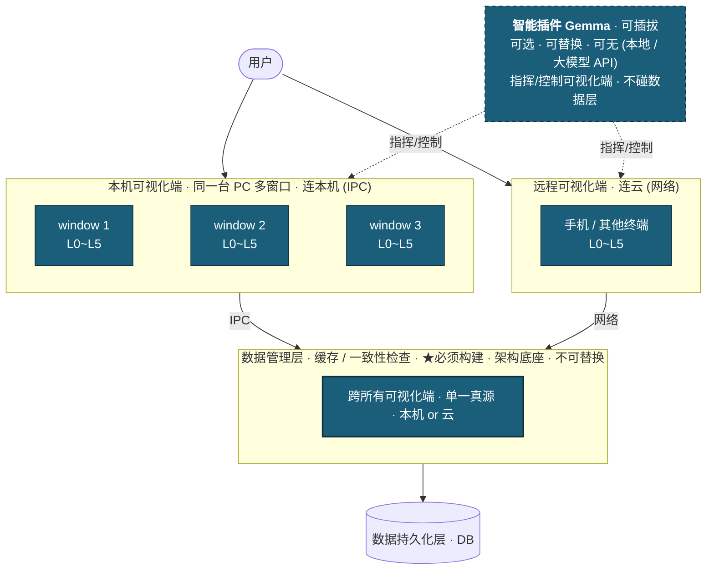

# 模块边界治理（架构总纲）

> **状态**：🔶 **体检完成，切割进行中**（2026-07-21 起）。
> **目标**：把「声称分层 L0~L5、实际仍纠缠」的模块边界真正理清，做到**每个模块可独立
> 部署 / 构建 / 迭代**（用户核心目标）。
> **定位**：这是**架构治理总纲**，超越多窗口——即使不做多窗口，这些违规也该治。
> [[multi-window-process-isolation]] 的 step1（依赖注入）= 本治理的**第一刀**（治震中）。
> **方法**：不凭「感觉乱」，扫真实 import 依赖定违规（[[dont-guess-look-at-real-data]]）。
> 完整性判据用「关模块隔离测试」——杀一个模块另一个不受影响（同 charter 反静默坍缩）。

---

## 〇、目标架构 —— 四层重定义（2026-07-21 用户拍板，切割的北极星）

用户提出新顶层分层。**现有整套 L0~L5 被重新定性为「可视化端」这一横向切片**；DB、数据管理、
Gemma 从中剥离，成为可视化端**之下/之旁**的独立层。这条重定义给「模块切割」提供了**根本分界线**。



**根本分界线（切割的那条线）**：**「单端可视化(L0~L5)」 vs 「跨端数据管理层」**
（智能插件 Gemma 不在数据侧，它站在可视化端之上指挥可视化端——见下「依赖流」）。
- **「端」= 本机窗口 or 远程终端，一视同仁**（用户补充）。分界线对多窗口/多终端是**同一条**；
  只是可视化端↔数据层的连接方式变（IPC ↔ 网络），分层不变。
- 这是「多窗口 = 多终端 B/S 本机预演」（[[multi-window-process-isolation]] 终局愿景）的**结构化**。
- **可视化端剥离得足够干净（只依赖注入的数据、不抓全局）→ 跑本机窗口还是手机，代码一样** =
  「模块可独立部署」的终极兑现。

**层中有层**：顶层（用户 / 智能插件 Gemma / 可视化端 / 数据管理层 / DB）；「可视化端」内部再分
L0~L5（视图→能力→语义）。勿混淆两级。

**★依赖流（用户校正 2026-07-21，图已改）**：`Gemma → 可视化端 → 数据管理层 → DB`。
- **Gemma 只指挥/控制可视化端（window），与数据管理层零连接、不碰数据**。= 落实
  [[multi-window-process-isolation]] §零铁律「Gemma 只指挥 window、不直写 DB；window 是唯一
  执行者兼唯一写入者」。
- 意义：① 所有数据变更唯一入口=window → 可追溯（[[reliability-charter]] 留痕/对账）；
  ② Gemma 不依赖数据层 → 保住「可插拔」（连了数据层就成数据层依赖方，与可选定位冲突）；
  ③ Gemma = **一个自动化的可视化端操作者**，与「手机终端也是可视化端」同构（B/S）。

**★关键原则：数据管理层 ≠ 智能插件（用户校正，非并列兄弟）**
| | 数据管理层（缓存/一致性） | 智能插件 Gemma |
|---|---|---|
| 必要性 | **必须构建·架构底座** | **可有可无·插件** |
| 可替换 | 不可替换 | 可替换（本地 Gemma / 大模型 API / 不装） |
| 地位 | 架构一等公民 | 挂载在架构上的插件 |

- **单向依赖铁律**：**无任何必选模块（可视化端 / 数据管理层 / DB）可 import Gemma**；只能 Gemma
  import 下层。否则「插件被焊死成地基」→ 剥夺可替换性。→ 是**比 V1~V4 更该防的违规**。
- **接口 > 实现**：谁用智能能力就调一个**稳定接口/契约**，不直接依赖 Gemma 实现。换本地/API/拔掉，
  其他层零感知。呼应 [[project-x-integration-phase01]] 的服务切换器/插件化范式。
- **时机**：Gemma 尚未实现（设计 v0.3）→ **现在没有此违规，但正因要实现了，此刻定死「插件·单向被
  依赖·可替换」边界最佳**——趁它没长根须。

**为什么 workspaceManager 是震中（用新分层解释）**：它**跨骑在分界线上**——混装了两种东西：
① 「我这个 window 的 ws 状态」（属**可视化端**，该留 window 内）② 「所有 ws 的全局注册表 /
跨窗协调」（属**数据管理层**，该剥离出去）。震中 = 这条骑缝线。**沿分界线切 = 自然劈开震中**。
四处违规（§二）本质都是「本该在数据层的东西漏在可视化端，或反之」。

---

## 一、体检结论（2026-07-21，扫全仓真实 import）

### 1.1 好消息：**地基干净**

- ✅ **storage / semantic（L0）= 零违规、纯 leaf**，不反向依赖任何上层。
- ✅ **违规类型「下层 import 上层」= 一处都没有**。最该守的铁律「下层不知上层」，**底层守得死死的**。
- → 乱的**不是地基，是上层相互纠缠**。根基对，好治。

### 1.2 坏消息：所有纠缠有**单一震中** = `workspaceManager`

- **`workspaceManager` 被 import 330 次，全仓最大连接枢纽**，且跨所有层被抓：
  `views(L5) 42 处 / capabilities(L4) 5 处❌ / shell(L2) 3 处 / slot(L3.5) 1 处❌`。
- **「模块可独立部署」就卡在这一个单例上**。判词：
  - 能独立部署：**storage / semantic / platform / lib**（底层，干净）
  - **不能**独立部署：capabilities / workspace / slot / views / shared —— 全因直接或间接抓
    `workspaceManager`（或彼此循环）。

### 1.3 依赖矩阵（原始依赖图，跨层比例=纠缠度）

```
[storage/L0]      → semantic·platform·shared           （干净）
[semantic/L0]     → (none 纯 leaf)                       （干净）
[platform/L0]     → 几乎所有（L0 调所有层，符合预期）
[shell/L2]        → workspace·slot·shared·capabilities   75% 跨层
[workspace/L3]    → slot(21)·shell(1)                    95% 跨层
[slot/L3.5]       → shared·capabilities·workspace(3)     65% 跨层
[capabilities/L4] → slot·drivers·shared·semantic·workspace(5) 63% 跨层
[views/L5]        → slot(152)·capabilities(124)·workspace(54)·shared·shell 90% 跨层（最纠缠）
[shared]          → drivers·capabilities                （本应纯 leaf，却反依赖上层）
```

---

## 二、四处违规（按严重度，全部有 file:line 证据）

| # | 违规 | 严重度 | 证据 |
|---|------|--------|------|
| **V1** | **capabilities(L4) 抓 workspace(L3) 单例** | 🔴 HIGH | text-editing 5 文件直接 import workspaceManager：`handle-menu/items.tsx:32`、`HandleFormatSubmenu.tsx:22`、`link-panel/LinkPanel.tsx:19`、`color-picker/HandleColorSubmenu.tsx:19`、`commands/register-pm-commands.ts:19` → text-editing **无法独立部署** |
| **V2** | **workspace ↔ slot 循环依赖** | 🟠 MED | `workspace-manager.ts → @slot/workspace-bus`（正向）；而 `@slot/keymap-registry/keymap-listener.ts:44` **运行时** import workspaceManager 单例（回边）→ 闭环 → 两者**谁都拆不出** |
| **V3** | **shared 不是纯 leaf** | 🟠 MED | `shared/ipc/electron-api.d.ts:22` import `@capabilities/note/types`；`:37`、`shared/ipc/x-types.ts:9` import `@drivers/...` → shared 反向依赖上层 |
| **V4** | **workspace(L3) 抓 shell(L2) 资产** | 🟡 LOW | `workspace/workspace-instance/view-switcher-frame/ViewSwitcherFrame.tsx:18` 硬编码 `@shell/assets/logo.jpeg` |

**最纠缠 top5**：views(90% 跨层，god consumer) / capabilities-text-editing(V1 热点) / workspace(95%+循环) /
slot(循环根) / shared(V3 泄漏)。

---

## 三、切割计划

### 3.1 关键洞察：V1、V2 半个 = 同一个根（震中 workspaceManager 被跨层/循环抓）

多窗口 step1 定的**依赖注入**（[[multi-window-process-isolation]] §12.1.1）**就是治震中的主刀**：
- `workspaceManager` 不再被「伸手抓」而是「注入」后：
  - **V1 消失**（capabilities 收注入的 wsId，不 import workspaceManager）
  - **V2 回边消失**（slot keymap-listener 不再抓单例，循环断一半）

### 3.2 三个独立小切口（各自单独修，与主刀并行）

- **V2 正向依赖**：workspace→slot 的 `WorkspaceBus` 依赖 → 待评估（bus 抽到中立位？或类型化解耦）。
- **V3 shared 泄漏**：把 shared 反依赖的 capability/driver 类型**下沉或内联**，让 shared 回归纯 leaf。
- **V4 logo 资产**：ViewSwitcherFrame 的 logo 改为 **prop 注入 / shared 常量**，不硬 import @shell。

### 3.2b ⚠️ 迁移顺序纠正 —— 「先净化内部，再套多窗口壳」（2026-07-21）

**否决的直觉方案**：「去掉 workspace tab + 外面封装多窗口壳 = 第一步迁移」。
- **为何错**：震中 `workspaceManager`（330 次跨层抓）**在可视化端内部(L2~L5)，不在窗口壳那层**。
  「外面套壳」一行都碰不到震中 → 得到「能开多窗口、但内部照样纠缠」的 app。
- **更糟**：多窗口会让内部纠缠**从隐藏变爆炸**——`workspaceManager` 的「全局唯一 activeId」假设
  单窗口能跑，多窗口下每窗该有自己的 ws 却只有一个全局 active → **两窗口互相打架**（甚至跑不起来）。
- **本质**：「套壳」是 §12.1 迁移路线的**第三步（建框架）**，不是第一步。跳过第一步（解耦内部）
  直接第三步 = 把还在互抓全局单例的模块装进新壳 = **叠好脏衣服放进新柜子**。

**正确顺序（用户拍板）**：
```
❌ 直觉：去 tab → 套壳                  （跳过震中，埋「两窗打架」债）
✅ 正确：先解耦 L2/L3(拔震中·依赖注入) → 套多窗口壳 → 迁 L4/L5
         └─ 第一步真身 = §12.1.1 step1，非套壳
```
- **第一步 = 解耦内部、依赖注入拔 workspaceManager**（内部净化）。
- **套壳是第二步，且会变轻松**——因为内部已净化成「每可视化端自包含、只吃注入的数据」，
  壳只需给每窗注入它自己的 ws 上下文。

### 3.3 切割顺序（待与用户确认）

主刀（依赖注入治震中，= 多窗口 step1）优先；三小切口可并行或穿插。每刀完成过**关模块隔离测试**
（[[multi-window-process-isolation]] §12.3）验收：目标模块能被单独 grep 证明不再抓 workspaceManager /
不再有回边 / shared 无上层 import。

**完整性判据（全仓 grep 归零）**：
- `import.*workspaceManager` 在 capabilities/ 下 = 0（V1 清）
- workspaceManager 运行时 import 在 slot/ 下 = 0（V2 回边清）
- shared/ import @capabilities|@drivers = 0（V3 清）
- @shell import 在 workspace/ 下 = 0（V4 清）
