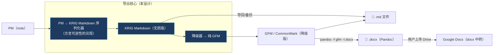

# Note 导出设计（Markdown / Word / Google Docs）

> **状态**：设计草案，待总指挥审阅拍板，未实现。
> **定位**：导出是导入的**镜像**，复用同一条 markdown 中枢。导入是「各种源 → KRIG Markdown → PM」，导出是「PM → KRIG Markdown → 各种目标格式」。两侧共用 [[krig-markdown-dialect-spec]] 定义的方言，架构闭环。
>
> **已拍板决策（2026-07-26）**：
> - **Markdown 导出两版**：无损版（带 KRIG 扩展，可无损导回/备份）+ 降级版（纯 GFM，给外部工具正常渲染）。
> - **Word（.docx）**：走 **Pandoc**（`markdown → docx`），复用现有导入 Word 的 pandoc 二进制（`converter-pandoc.ts` 已在用 `docx → gfm`，导出就是反向）。零新依赖。
> - **Google Docs**：**走 docx 中转**（导出 docx → 用户上传 Google Drive 自动转 Google Docs）。零集成、零 OAuth。Google Docs API 直连留 V2。

---

## 一、总架构：导出复用 markdown 中枢



**唯一要新建的核心 = `PM → KRIG Markdown` 序列化器**。它就是 [[krig-markdown-dialect-spec]] §六「往返可逆性」的兑现。有了它：
- `.md` 导出 = 直接输出（无损版）或过降级器（GFM 版）。
- `.docx` = GFM 版喂 pandoc（现成）。
- Google Docs = docx 上传 Drive（用户操作，零代码）。

**与导入的对称性**（复用点）：

| | 导入 | 导出 |
|---|---|---|
| 中枢 | `markdownCore`（md→PMNode[]） | **新增** `pmToKrigMarkdown`（PMNode[]→md） |
| 方言 | 解析 KRIG 扩展语法 | 生成 KRIG 扩展语法 |
| 降级 | 读外部 md 时向上兼容 | 写外部 md 时向下降级 |
| Word | pandoc `docx→gfm`（converter-pandoc.ts） | pandoc **`gfm→docx`**（同二进制） |
| 媒体 | base64/远程 → `media://`（本地化） | `media://` → 文件/base64（**可移植化**，反向） |

---

## 二、核心：PM → KRIG Markdown 序列化器

**签名**（对称于导入的 markdownCore）：
```ts
// 无损：产出带 KRIG 扩展的 markdown（可无损导回）
pmToKrigMarkdown(nodes: PMNode[], opts?: { mediaResolver? }): string
// 降级：产出纯 GFM（富 block 降级，外部可读）
pmToGfm(nodes: PMNode[]): string   // = pmToKrigMarkdown + downgrade pass
```

**逐 block 生成规则**（对称于方言规范三档）：
- **档 1/2**（原生 + GFM）：直接生成标准语法（heading→`##`、code→` ``` `、table→`|`、callout→`> [!NOTE]`、math→`$$`…）。
- **档 3**（KRIG 扩展）：生成 `:::name` / `` / `{attrs}`。
- **inline marks**：bold/italic/code/strike/link → 标准 markdown；noteLink → `[[]]`。

**关键子问题**：
1. **media:// 解析**（可移植性，方言开放问题#2 在此触发）：导出时 `media://xxx` 必须变成可移植的东西——base64 内联 或 相对路径 + 资源目录随 md 打包。`opts.mediaResolver` 注入策略。
2. **可逆性验证**：`md → PM → md` 幂等（方言 §六契约测试已覆盖思路）。

---

## 三、降级映射表：KRIG 扩展 block → 各目标格式

> 每个富 block 在「纯 GFM / docx / Google」里降级成什么。**铁律同方言：绝不吞内容。**

| KRIG block | → 纯 GFM（.md 降级版） | → docx（pandoc） | 备注 |
|---|---|---|---|
| callout（emoji+color） | `> [!NOTE]`（GFM alert，GitHub 认） | 带边框/底色的引用块或表格 | Notion 对齐的 color 在 docx 可保留为底色 |
| toggleList | 标题行加粗 + 展开内容（去折叠） | Heading + 正文（Word 无折叠） | 内容全在，失折叠交互 |
| columnList/column | 各栏顺序平铺（去分栏） | 单栏顺序 或 docx 分栏（pandoc 有限支持） | markdown 天生无栏 |
| videoBlock | `[▶ 视频](url)` 链接 | 超链接文本 | 无法内嵌播放 |
| audioBlock | `[🔊 音频](url)` 链接 | 超链接 | 同上 |
| tweetBlock | `[推文](url)` | 超链接 | |
| htmlBlock/externalRef | `[链接标题](url)` | 超链接卡片 | |
| fileBlock | `[📎 文件名](path)` | 附件链接（或嵌入） | media:// 需可移植化 |
| mathBlock/mathInline | `$$`/`$`（保留 LaTeX） | pandoc 转 Word 公式（OMML）✅ | pandoc 原生支持 math→docx |
| mathVisual | 降级为静态图 或 `$公式$` | 图片 | KRIG 独有，无对应 |
| image（宽高对齐） | ``（丢属性） | pandoc 保留尺寸 | 属性有损 |
| table（合并单元格） | 拆成规则表 或 raw | pandoc 支持合并 | |

---

## 四、各目标格式的实现路径

### 4.1 Markdown（.md）
- **无损版**：`pmToKrigMarkdown()` 直接写文件。顶部可加 frontmatter `--- krig-md: 0.1 ---`。媒体：`media://` → 同目录 `assets/` 相对路径 + 打包成 zip，或 base64 内联（用户选）。
- **降级版**：`pmToGfm()`。给 GitHub/Typora/Obsidian 用。
- **粒度**：单篇 note / 多篇（文件夹树 → md 文件树，对称导入的 folder 树）。

### 4.2 Word（.docx）
- **链路**：`pmToGfm()` → 临时 .md → `execFile(pandocPath, ['-f','gfm','-t','docx','-o','out.docx', ...])` → docx。
- **复用**：pandoc 二进制 + detector 与导入 `converter-pandoc.ts` 同一套。媒体走 pandoc `--resource-path` 或先把 media:// 解析成本地文件。
- **约束（已知）**：pandoc 依赖用户系统安装（导入侧 detector 不可用时降级 mammoth；**导出侧无 mammoth 反向**）。→ 没装 pandoc 时：提示用户安装，或**降级为「只导出 .md，请用 Word/Google 打开」**。
- **math**：pandoc `gfm+tex_math_dollars → docx` 原生转 Word 公式（OMML），无损 ✅。

### 4.3 Google Docs（docx 中转）
- **零代码**：导出 .docx → 用户上传 Google Drive → Drive 自动转 Google Docs（原生支持 docx 导入）。
- **UI 提示**：「已导出 Word 文件，上传到 Google Drive 即可转为 Google Docs」。
- **V2 可选**：Google Docs API 直连（OAuth + Docs API batchUpdate block 映射）——重，非必要。

---

## 五、导出的横切问题

1. **媒体可移植化**（`media://` 反向解析）：这是导出**新触发**的需求（导入是 →media://，导出是 media://→）。策略：
   - .md：`assets/` 相对路径 + zip 打包，或 base64 内联。
   - .docx：pandoc resource-path 指向解析出的本地文件。
2. **粒度**：单篇 / 文件夹批量 / 整库。文件夹导出 → 目录树（对称导入的 folder 树建立）。
3. **导出入口**：note toolbar「导出」下拉（md 无损 / md 降级 / Word）+ 文件夹右键「导出为...」。
4. **降级提示**：导出降级版时，若有富 block 被降级，UI 提示「toggle/分栏等已转为普通格式」（fail-loud，不静默丢体验）。

---

## 六、分阶段

- **E1**：`pmToKrigMarkdown` 序列化器 + 单篇 .md 导出（无损 + 降级两版）。这是核心，其余都依赖它。契约测试：`md→PM→md` 往返幂等（复用方言 §六）。
- **E2**：媒体可移植化（media:// → assets/zip 或 base64）。
- **E3**：Word 导出（pandoc gfm→docx，复用导入 pandoc 链）+ 没装 pandoc 的降级。
- **E4**：文件夹/批量导出（目录树）。Google Docs 靠 docx 中转，无需独立开发。
- **E5（可选）**：Google Docs API 直连。

**依赖**：E1 依赖 [[krig-markdown-dialect-spec]]（PM↔md 可逆序列化是方言的一部分）和 [[import-to-note-convergence]] B 阶段的 markdownCore（导入侧）。建议导出 E1 与导入 B 阶段**同期做**（一个抽解析、一个抽序列化，共享方言与降级映射，收益叠加）。

---

## 待拍板的开放问题

1. **媒体打包策略**：.md 导出时 `media://` 用 base64 内联（单文件自包含，但体积大）还是 `assets/` 相对路径 + zip（干净但多文件）？还是让用户选？
2. **没装 pandoc 时 Word 导出怎么办**：提示安装 / 静默降级为 .md / 内置一个 pandoc 二进制（体积代价）？
3. **导出粒度 v1 范围**：只做单篇，还是一步到位做文件夹批量？
4. **E1 与导入 B 阶段是否同期做**（共享方言序列化与降级映射，收益叠加）？

---

## 附：相关文档
- [[krig-markdown-dialect-spec]] — KRIG Markdown 方言（导出序列化 = 其可逆性的兑现）
- [[import-to-note-convergence]] — 导入路径收敛（导出是其镜像）
- `docs/10-business-design/ebook/PDF-Note-Atom数据契约-v2.1.md` — 现行 PDF 契约
- `src/platform/main/word-import/converter-pandoc.ts` — 现有 pandoc 集成（导出复用其二进制/detector）
