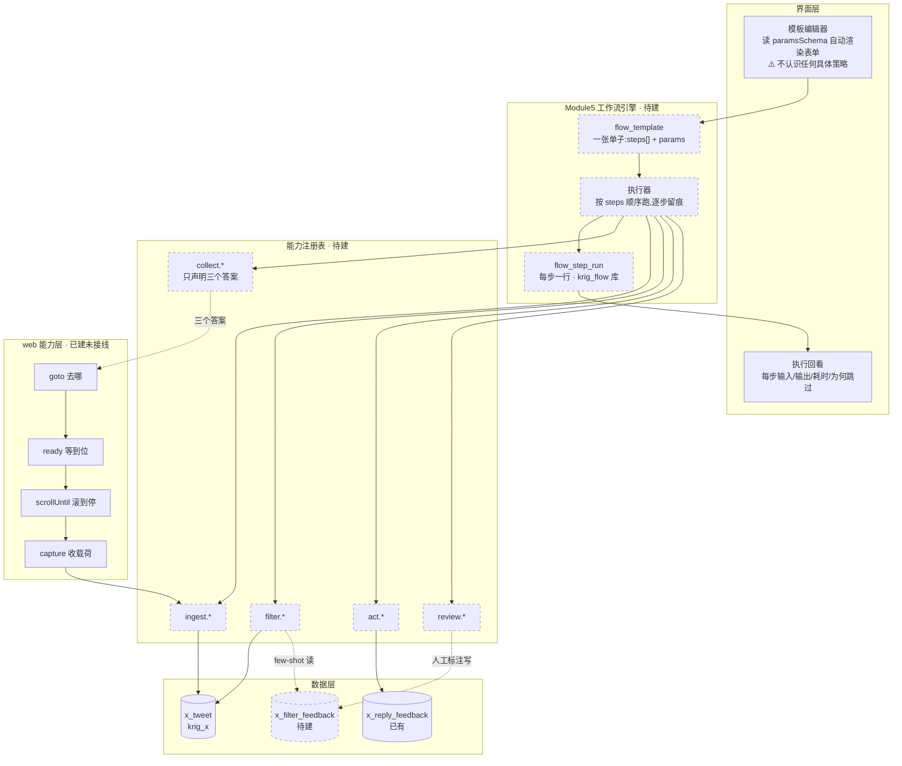
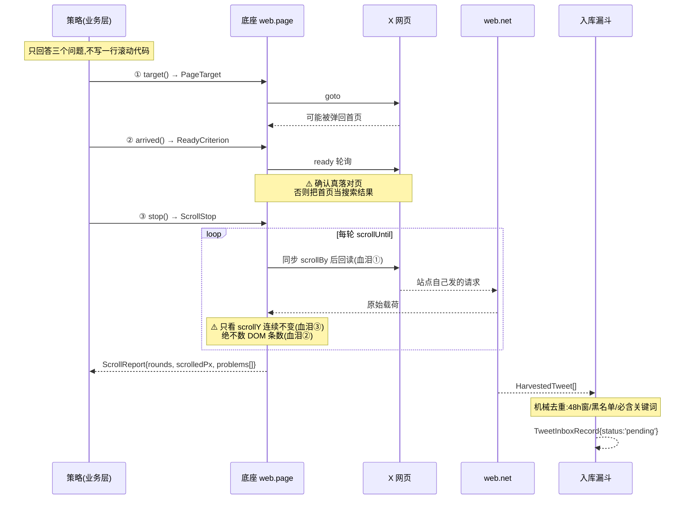
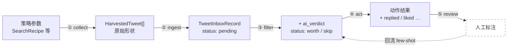
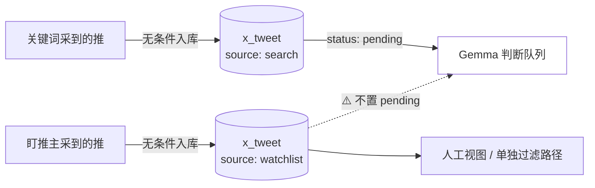
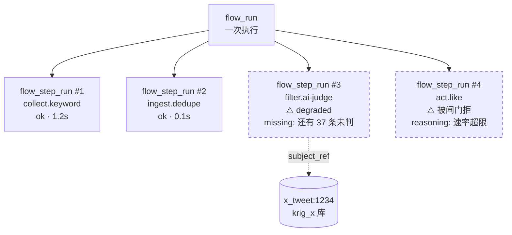

# Module 5 · X 业务线设计(五步:策略 → 获取 → 过滤 → 处理 → 复核)

> 立于 2026-09-09。承接 `Module5-01-workflow-model.md`(工作流模型)。
>
> **本文是设计,不含实现。**
>
> 用户 2026-09-09 给出的五步:
> 1. 制定搜索策略(常规浏览 / 盯某条推 / 盯某个推主 / 关键词)
> 2. 获取搜索结果
> 3. 分析过滤 —— ⭐ **AI 学习过滤策略,要有迭代学习能力**
> 4. 处理 —— AI 对满足条件的推文做处理(点赞 / 转发 / 回复 / 收藏)
> 5. 保留处理结果,**人工抽查 / 审核 / 迭代**

---

## 0. ⭐ 这五步是「模板的形状」,不是一条链

`Module5-01` §5 写的「采集→判断→拟回复」是**一条具体的链**。
用户这五步是**一个可复用的形状** —— 第 1 步可换,后四步共用。

| | 01 号文档写的 | 本文(用户口径) |
|---|---|---|
| 第 1 步 | 固定 = 跑 recipe | ⭐ **策略可插拔**(4 种来源) |
| 第 3 步 | 判断(一次性) | ⭐ **会学习的过滤**(有反馈回路) |
| 第 4 步 | 拟回复(单一动作) | ⭐ **四种动作** |
| 第 5 步 | 无 | ⭐ **人工复核 → 喂回第 3 步** |

> **用户的形状是对的**,01 号那条链只是它在
> 「关键词策略 + 回复动作」下的一个特例。

## 0.1 ⭐ 第 5 步构成回路 —— 但没有突破「不做循环」的裁定

```
1 策略 → 2 获取 → 3 过滤 ⇄ 5 复核
                    ↓         ↑
                  4 处理 ──────┘
```

`Module5-01` §4.1 裁定「可重组步骤,**不做条件分支 / 循环**」。回路算不算循环?

**不算。** 区别是:

| | 定义 | 本轮 |
|---|---|---|
| **循环** | 一次执行**内部**反复跑(`while 没到底就继续滚`) | ❌ 不做 |
| ⭐ **回路** | **跨执行**的数据流:这次的标注,改变**下次**的过滤 | ✅ 本文要做 |

在模型上,回路 = 「过滤这一步有一个**输入**叫『学到的策略』,
而这个输入由第 5 步产出」。**仍然是有向的步骤序列,只是有一步的输入来自历史。**
不需要表达式语言,不需要分支。

> ⭐ 但它逼出 `Module5-01` 里没有的一条:
> **步骤的输入可以来自「历史执行的产物」,不只是「上一步的产物」。**
> 这条要补进步骤契约。

---

## 1. 第 1 步 · 制定搜索策略

⭐ **四种策略是同一个位置上的可替换实现** —— 这正是「可重组」的价值所在。

### 1.1 实测:四种策略的实现程度差异极大

| 策略 | 实现程度 | 位置 | ⚠️ 缺口 |
|---|---|---|---|
| **关键词配方** | ✅ **唯一在定时跑的** | `scanRecipe`(`x-timeline-scan.ts`)+ `search_recipes` 表 | —— |
| **常规浏览** | ⚠️ **底座最扎实,但没接业务** | `harvestTimeline`(`x-timeline-harvester.ts`),任意 URL 通吃 | ⚠️ `X_HARVEST` handler 明标「**只读不落库**」(`x-timeline-handlers.ts:470`)——「底座函数的验证入口,过关后才谈接业务」 |
| **盯某条推** | ⚠️ **有,但绑死 campaign** | `x-article-replies.ts`,按会话取(`conversation_id_str === article_id`) | ⚠️ **只跑 `role='campaign'` 的 ws**;主循环以通知页为主,而通知只覆盖「别人对**我**」——**拿不到「第三方对第三方」**(X 2024-06 移除) |
| **盯某个推主** | ❌ ⭐ **半成品:四层齐了,唯独采集循环不存在** | 见 §1.2 | ⚠️ 见 §1.2 |

> ⭐ **`harvestTimeline` 的四条血泪已固化在文件头**(`:12-31`),
> 与 `web/capability-layer/01-contract.md` §9.5 的 `scrollUntil` 同源。
> 常规浏览策略**直接用它**,不要重写滚动。

### 1.2 ⚠️ 「盯推主」是最需要注意的一个 —— 四层齐了,但**采集循环从没跑起来**

| 层 | 状态 | 证据 |
|---|---|---|
| 存储 | ✅ | `x_author.watched/watched_at/watch_source/watch_depth` + 索引(`x-schema.ts:56-66`) |
| Repo | ✅ | `watchAuthor`/`unwatchAuthor`/`listWatched`/`listWatchCandidates`(`x-author-repo.ts:299-375`) |
| IPC | ✅ | `X_WATCHLIST`(`x-timeline-handlers.ts:990-1015`) |
| UI | ✅ | `WatchlistView.tsx`,入口 `XInboxView.tsx:890` |
| ⭐ **定时采集** | ❌ **不存在** | 调度器循环里 grep 只命中 `scanRecipe`;`listWatched` 全仓仅两个调用方,**都在 IPC handler 内给 UI 列名单,不采数据** |

> **可以把人加进名单、能看到名单和统计,但没有任何东西会因为「他在名单里」而去定期抓他的新推。**
>
> ⚠️ 全仓 grep `'watchlist'` **只命中 schema 里那行注释本身,零个写入点** ——
> 从来没有一行数据以 watchlist 身份写入过。

#### ⚠️⚠️ 别把两件事混为一谈(2026-09-09 用户纠正,本节初稿措辞有误)

初稿标题写的是「**看着有,其实不采**」。⚠️ **「不采」是错的措辞**,
它把「采集循环没实现」和 schema 里那条「不进判断队列」粘成了一件事,
读起来像是**设计上决定不采 watchlist 的推文**。**不是。**

| 事实 | 是什么 |
|---|---|
| 采集循环不存在 | ⚠️ **实现缺口** —— 这条路压根没跑起来 |
| `source='watchlist'` 不置 pending | ✅ **有意的设计**,且**只管第 3 步**,不管采不采 |

⭐ **schema 那条注释**(`x-schema.ts:97-98`)说的是:

> watchlist 推文**不进 AI 判断队列**(不置 pending),
> 否则**刷爆 Gemma 队列、污染待处理收件箱**。

**它恰恰预设了这些推文会被采、会入库** —— 只是入库后不排队等 Gemma 判。

#### ⭐ 采集/入库层面:watchlist 推文**当然要全采全存**

用户 2026-09-03 已定(`redesign-06` §1):

> 「**不要过滤,入库后前端就可以请求了**」……原先在**采集层**就把推荐流丢掉,
> 结果是**丢掉的永远查不回来**……现在改为:**全部入库**,
> 是不是互动交给**查询层**判断。

⭐ 这与 `web/capability-layer/01-contract.md` §13「**缓存层无条件收下一切**」
是同一条原则 —— **用户在两个地方各定过一次**。

> ⭐ **所以本文的立场**:采集层、入库层**无条件收下**;
> **「进不进 Gemma 判断队列」是下游的调度问题,不是采集问题。**
> 两者混在一起,就会重演「在采集层丢掉、永远查不回来」那个错。

**这条规则本文照收** —— 见 §3.5。⚠️ 但要写清它的**作用域是判断队列**,
措辞上不许再滑成「不采」。

底层能力其实有:`probeAuthorTimeline`(`x-author-timeline-spike.ts`,走 `/<handle>/with_replies`
而非搜索),⚠️ 但文件头自称「**一次性诊断工具,只读不写…方法定稿后应删除或收编**」,至今未收编。

### 1.2.1 ⭐⭐⭐ 用户的洞察:四种策略共用同一个骨架(2026-09-09)

> 「都有一个特点,就是**有特定的 web 页面处理并上下滚动**,对吗?
>  说白了就是**盯住一个页面,对这个页面进行操作**。」

**实测验证成立。** 三个现有实现逐条同构:

| | `scanRecipe` | `harvestTimeline` | `x-article-replies` |
|---|---|---|---|
| 入参本质 | recipe → **拼出 URL** | **直接给 URL** | articleId → **拼出 URL** |
| 骨架 | 导航 → 等元素 → 确认落对页 → 滚 → 抓 | 同 | 同 |

⭐ **唯一的真差异是「URL 怎么来」和「什么时候停」。**
中间那段 —— 导航、等到位、确认没被弹回、滚、边滚边收网络载荷 ——
**是同一件事写了三遍**。

#### ⚠️ 这坐实了那四条血泪的来源

`x-timeline-harvester.ts` 文件头写着:

> 「滚动逻辑曾散在**三个文件**,同一 bug **修三遍**,每次都以为修好了。
>  用户拿官网数据一核对 —— **10 天 433 条回复,库里只有 81 条(19%)**。」

**那三个文件,正是这三个策略。** 用户指出的「都是盯住一个页面滚」,
就是它们本该共用却没共用的那一层。

> ⭐ `web/capability-layer/01-contract.md` §9.5 早已记下同一个洞察:
> 「现有 `harvestTimeline` 把 `loadURL + 滚动 + 捕获 + 判停` **缝死在一个函数**里,
> 结果『只滚不抓』『抓但不导航』『换判停规则』**全做不到**。」
> **`scrollUntil` 就是为这个建的。**

### 1.2.2 ⭐⭐ 分层:骨架进底座,三个答案留业务层(用户 2026-09-09 拍板)

```
┌─ 底座(web 能力层)· 只有一份实现 ────────────────────┐
│  goto(去哪) → ready(等到位) → scrollUntil(滚到停) → capture(收载荷)  │
│  ⚠️ 不认识 X、不认识「推文」、不认识「搜索页」            │
└──────────────────────────────────────────────────┘
                          ↑ 传入三个答案
┌─ 业务层(X adapter)· 策略 = 三个答案,不是一段程序 ──┐
│  ① 去哪个页面      ② 怎样算到位      ③ 什么时候停     │
└──────────────────────────────────────────────────┘
```

**四种策略只是三个答案的不同填法**:

| 策略 | ① 去哪 | ② 怎样算到位 | ③ 什么时候停 |
|---|---|---|---|
| `keyword` | 关键词拼 `/search?q=…` | URL 含 `/search` | 滚到底 |
| `browse` | 直接给 URL | 元素出现 | 滚到底 / 满 N 条 |
| `tweet-watch` | 拼 status 页 | 落在该 status | 见到目标留言 |
| `author-watch` | 拼 `/{handle}/with_replies` | URL 含该 handle | 满 `watch_depth` 条 |

⭐ **判据比 §1.3 的注册制更硬**:

> **加一种新策略 = 填三个空,一行滚动/导航/载荷代码都不用写。**

#### ⚠️ 为什么分界必须画在这里

对应 `01-contract.md` §2 已定的铁律:

> **底座只做两件事:如实呈现事实、忠实执行动作。所有判断都在应用层。**

⭐ **「什么时候停」是个判断** —— 滚到底算停?抓够 50 条算停?见到某人留言算停?
这取决于业务想要什么,**底座没资格替你决定**。

所以底座提供「**能滚、能停**」,但**停的条件由调用方传**
—— 与 `find` 那条铁律同源(找到多个不许自作主张挑一个)。

✅ **现有 `scrollUntil` 的签名正好承载第③个答案**:
`scrollUntil(pageId, stop: ScrollStop, options)`,
`ScrollStop` 已有 `atBottom | rounds | anchorAppears | custom` 四种(`control-types.ts`),
且血泪①(同步 `scrollBy` 后回读)③(连续多轮不变才算到底)**已内建**。

### 1.2.3 ⚠️ 这个概括的边界:不是所有取数都是「盯页」

⭐ **「盯住一个页面滚」不覆盖全部取数** —— 通知监听就不是:

| 类 | 形态 | 成员 |
|---|---|---|
| ⭐ **盯页作业** | **主动去、主动滚** | keyword / browse / 盯推 / 盯人 |
| **常驻监听** | ⚠️ **不导航、不轮询,等推送** | 通知监听 |

`x-notification-watch.ts` 的主体是 `captureXPayloads` **订阅**(`:433`),
只有 10s 心跳做**漂移纠正**,不是轮询。

> ⚠️ **别把常驻监听硬塞进「盯页」抽象** —— 那会逼出假的 URL 和假的停止条件。
> 它现在只有一个成员,但**是真正不同的形状**。

### 1.2.4 ⚠️ 收编顺序(风险控制)

⭐ **`scrollUntil` 已写完并有测试,但一条真实数据都没跑过**
(`01-contract.md` §15.1);而 `harvestTimeline` 是**真机验证过的** ——
那四条血泪是它踩出来的。

**所以顺序不可颠倒**:

```
① 先让 scrollUntil 跑通一条真实链路(观察窗看着)
② 与 harvestTimeline 行为对账 —— 同一页面、同样条数?
③ 确认等价后,才删旧实现
```

⚠️ **绝不能反过来先删。** 且硬约束:**`tests/x/` 512 必须全绿** ——
红了 = 新骨架与老实现**不等价**,不是「测试过时了」。

⭐ **用户 2026-09-09 定:先收一个验证,不要三个一起收。**
拿 `keyword` 打头(唯一在定时跑的、有真实数据可对账),跑通再收其余两个。
**理由:那四条血泪太贵,值得用「一次只动一处」来保护。**

### 1.3 ⭐⭐ 策略是**注册制**,不是枚举(用户 2026-09-09 拍板「不要写死代码」)

⚠️ **本节初稿写错了,已改。** 初稿写的是:

```ts
strategy: 'keyword' | 'browse' | 'tweet-watch' | 'author-watch'   // ❌ 写死
```

**这就是用户要反对的东西** —— 联合类型意味着**加第五种策略要改类型定义、改 switch 分支**,
于是每加一种采集方式都得动核心代码。用户原话:

> 「(盯推主)这个只是**一个例子**,也就是**不要写死代码**。」

⭐ **正确形态:能力注册表 + 契约**

⚠️ **注意与 §1.2.2 的分层配合** —— 注册的**不是一整套采集实现**,
而只是那**三个答案**。策略里**没有** `run()` 里自己写滚动的余地:

```ts
// 底座只认这个契约,不认识任何具体策略
interface CollectStrategy {
  id: string;                    // 'keyword' / 'author-watch' / 未来任意
  name: string;                  // 给人看的名字
  description: string;           // ⭐ 用户要的「有描述」
  paramsSchema: ParamSpec[];     // ⭐ 用户要的「有配置」—— UI 据此自动生成表单

  // ⭐⭐ 三个答案(§1.2.2)—— 骨架由底座跑,这里只回答
  target(params):  PageTarget;   // ① 去哪个页面
  arrived(params): ReadyCriterion;  // ② 怎样算到位
  stop(params):    ScrollStop;   // ③ 什么时候停
}

registry.register(keywordStrategy);      // 加一种 = 注册一个
registry.register(authorWatchStrategy);  // 不改任何现有代码
```

⭐ **契约里没有 `run()` 是刻意的** —— 有 `run()` 就等于允许策略自己写导航和滚动,
于是「同一 bug 修三遍」会**原样复发**。**策略只声明,不执行。**

**判据(与 `01-contract.md` §6「加新站点只写 adapter」同源)**:

> ⭐ **加一种新采集策略 = 新增一个文件 + 一行注册;
> 改动现有文件数 = 0,改动 UI = 0。**

`paramsSchema` 是关键:UI **不认识**任何具体策略,它只会读 schema 渲染表单。
所以新策略的配置界面**自动就有了** —— 这才叫「不写死」。

### 1.4 四种策略作为**注册表的初始成员**

它们是**例子**,不是穷举:

| id | 参数(经 `paramsSchema` 声明) | 现有底座 |
|---|---|---|
| `keyword` | 沿用 `SearchRecipe` 全部字段 | ✅ `scanRecipe` |
| `browse` | url + `maxScrollRounds`(⭐ 现硬编码 200) | ⚠️ `harvestTimeline` 有,但不落库 |
| `tweet-watch` | tweetId / conversationId + 轮询间隔 | ⚠️ 有,绑死 campaign |
| `author-watch` | handle[] + `watch_depth`(字段已有) | ❌ 只差调度 |

⚠️ **不同策略的输出必须是同一形状**(`TweetBatch`),否则后四步无法共用。
**这是「可重组」的硬前提**,也是注册契约里唯一不可协商的部分。

> ⭐ 而按 §1.2.2 的分层,**输出形状是底座保证的** ——
> 骨架统一 `capture`,策略根本没有机会产出不同形状。
> **抽象一旦画对,这条约束就不需要靠自觉遵守。**

> ⭐ **`author-watch` 的价值不在它本身**,而在于:
> 它是**第二个真实实现**,用来验证「注册制」这个抽象是不是真的成立。
> 一个实现证明不了可插拔 —— **只有第二个接进来时零改动,才算数**。

---

## 2. 第 2 步 · 获取结果

现有 `scanRecipe` 已把「获取 + 入库漏斗」缝在一起。**本文主张拆开**,理由与
`01-contract.md` §9.5「`scrollUntil` 必须与捕获解耦」同源:缝死会导致
「只滚不抓」「抓但不导航」「换判停规则」全做不到。

| 子步 | 现状 | 可配置项 |
|---|---|---|
| 取 | `harvestTimeline` / `scanRecipe` 内部 | ⭐ `maxScrollRounds`(现硬编码 200) |
| 入库漏斗 | `DEFAULT_FILTER_CONFIG` | ⭐ `dedupeWindowHours:48` / 黑名单 / `requireKeywords` |

> ⚠️ **入库漏斗不是第 3 步。** 它是**机械去重**(48 小时窗、黑名单、必含关键词),
> 无判断、无学习。**第 3 步才是判断。** 两者混在一起会让「过滤掉的」无从区分
> 是「重复」还是「AI 认为不值」。

---

## 3. ⭐⭐ 第 3 步 · 分析过滤 + 迭代学习(本文重点)

### 3.1 实测:判断层**完全没有**学习,标注只是存着

| 事实 | 证据 |
|---|---|
| `x-ai-judge.ts` 用**硬编码 `SYSTEM_PROMPT` 常量** | `:23-62`,人手写死的规则清单(5 条 worth=true / 7 条 worth=false) |
| 调用时 messages **只有两条** | `:177-187`;user content 只含 `{tweetId, text, lang}`(`:171-173`)——**无示例、无历史、无作者画像、无上文** |
| 该文件**不 import 任何 feedback repo** | `:7-10` |
| 唯一的「迭代」是**人手改 prompt** | `:25` 注释「2026-09-07 用户订正,此前这里只写了一边」 |

`tweet_feedback` 的**全部三个读取方,没有一个反哺策略**:

| 读取方 | 干什么 | 反哺? |
|---|---|---|
| `X_REPLAY_REPLIES` | 离线回放算 precision/recall | ❌ 只显示 |
| `X_QUERY_FEEDBACK` | 吐样本给 renderer | ❌ **无下游消费,注释自称「Phase 3b 预留」** |
| `getFeedbackStats` | 近 7 天三个计数 | ❌ 只显示 |

### 3.2 ⚠️⚠️ 不要建在现有 7034 行标注上 —— 用户已拍板

`tweet_feedback` **7034 行**看着是厚家底,但:

- ⭐ **Gemma 原判快照覆盖率仅 128/6968 ≈ 1.8%** —— 其余只有人工标签、**无 AI 对照组**,
  存量**无法回填**(`redesign-05` §8.2)
- 用户 **2026-09-09 已拍板**:`tweet_feedback` **不迁、不备份、新逻辑不读它**

**理由(用户口径)**:同一条推被标注多次结果可能不同(**标准本来就在漂**);
40 天里中途改过筛选标准(英文噪音降 83%)。由此——

> ⭐ 「Gemma 准确 93.8%」严格说只是「**与当时标注的一致率**」,不是客观准确率,
> **分母本身可疑**。

> ⚠️ 这与记忆 `feedback-dont-overextend-a-measurement` 同源:
> **别拿一个指标去否定/证明它没测的东西。**

### 3.3 ⭐ 但有个现成的正确范式可以搬:`x_reply_feedback`

**生成层已经跑通了真闭环**,而且形态正确:

| 要素 | 实现 | 位置 |
|---|---|---|
| **多行不覆盖** | 索引**故意不设 UNIQUE**(允许多次投票) | `x-schema.ts:181` |
| **精确 diff** | `edited` 由**主进程自己算,不信 renderer** —— 它是放手判据的分子 | `x-timeline-handlers.ts:949-950` |
| ⭐ **few-shot 回流** | `approvedExamples` 取 `action='filled' AND edited=false` 近 5 条 | `x-reply-feedback-repo.ts:125-137` |
| **分语言放手门槛** | `getReadiness`:`MIN_SAMPLES=50` / `MIN_PASS_RATE=0.8` | `x-reply-feedback-repo.ts:71-113` |

⭐ **`x-reply-planner.ts:173-178` 的注释说清了性质**:

> 「⚠️ 这**不是训练模型**,是 **in-context learning:立刻见效、随时可撤**。
> 学习期积累的修改就从这里回流。」

> **这套只作用于「怎么回」,要迁到「该不该回」上。**

### 3.4 ⭐ 迭代学习的形态裁定:用 in-context,不调阈值、不微调

| 档 | 做法 | 裁定 |
|---|---|---|
| **轻** ⭐ | 把标注当 **few-shot 例子**喂进 prompt | ✅ **本轮采用** —— 本仓已验证有效(`x_reply_feedback` 那条链是通的) |
| 中 | 用标注**自动调阈值 / 关键词权重** | ❌ 不做。⚠️ 见 §3.6:现有分数字段全是死的,没有可调的东西 |
| 重 | 微调本地 Gemma | ❌ 不做。另一个工程 |

**理由**:
1. 「立刻见效、随时可撤」——**改错了删掉例子即可**,不像微调不可逆
2. 本仓**已有成功先例**,不是赌一个没验过的路子
3. 记忆 `feedback-dont-overextend-a-measurement` 实测:给 Gemma **事实清单**后生成质量好
   (微信支付会主动先说不支持)、7 个诱导问题 0 编造 ——
   ⭐ **安全来自约束输入,不是剥夺模型能力**

### 3.4.1 ⭐⭐ 为什么要有标注闭环 —— 用户重新定义了这个问题

问的是「用不用那 7034 行」,用户回答的是**为什么要有闭环**:

> 「新标注是针对**不断产生新的业务**来形成的流程闭环。一句话,
> 这个 AI 要成为我的**私人助理**,就必须满足**执行不断产生的新任务**的能力。」

⭐ **这把设计要点整个换了**:

| | 我原先的问法 | 用户的口径 |
|---|---|---|
| 目标 | 把历史数据用起来 | ⭐ **新业务不断产生 → 每种都要能从零学会** |
| 衡量 | 存量有多少 | ⭐ **一个新策略上线后,多快能学会** |
| 于是 | 纠结 7034 行可不可信 | **存量根本不是重点** |

**直接后果:`strategy` 字段不只是分类,它是「学习的隔离单元」。**

新策略有**自己的样本池**,不被旧策略的平均值污染 ——
否则「回国需求」配方刚上线的十几条标注,会被「翻墙」配方几千条历史淹没,
**学到的永远是旧业务的口味**。

> ⚠️ 这也解释了为什么存量不可信不要紧:
> **私人助理的价值在「学会新任务」,不在「记得旧任务」。**

### 3.5 新标注表:照 `x_reply_feedback` 范式建

⚠️ **不复用 `tweet_feedback`**(§3.2)。新表要点:

```
x_filter_feedback(暂名)
  tweet_id / text / lang / author_handle
  verdict          人工判定(worth | skip)
  ai_verdict       ⭐ 机器原判**整份快照**,与人工判定**并存**,谁也不盖谁
  reason_tag       为什么(可选,做 few-shot 时最有用)
  strategy         ⭐ 哪种策略采来的(keyword/browse/tweet-watch/author-watch)
  recipe_ref       具体配方/来源
  created_at
```

⭐ **`strategy` 字段是新增的关键**:不同策略采来的推文,**判断标准可能不同**
(盯推主的推文本来就该宽松,关键词搜来的要严)。混在一起学 = 学出一个平均值。

⚠️ **多行不覆盖**(索引不设 UNIQUE),沿用 `x-schema.ts:181` 已验证的做法。

⭐ **watchlist 推文不进 AI 判断队列**(§1.2,schema 已定的规则):
盯推主采来的推**不置 pending**,否则刷爆 Gemma 队列。

⚠️⚠️ **这条只管「排不排队等 Gemma 判」,不管「采不采、存不存」**:

| 层 | watchlist 推文 |
|---|---|
| 采集 / 入库 | ⭐ **无条件全采全存**(用户 2026-09-03 定,见 §1.2) |
| 进 Gemma 判断队列 | ❌ 不进(否则刷爆队列) |
| 查得到吗 | ✅ **查得到** —— 它们在 `x_tweet` 里,只是 `status` 不是 pending |

**它们走单独的过滤路径或直接进人工视图** —— 是「换条路走」,**不是「被丢掉」**。

> ⚠️ 措辞纪律:凡涉及这条规则,一律写「**不进判断队列**」,
> **绝不许写成「不采」「过滤掉」「跳过」** —— 那会重演
> 「在采集层丢掉、永远查不回来」那个已被用户否决过的错。

### 3.6 ⚠️ 三个「看着像能力、实际不是」的字段/入口

设计时**不要误计**:

| 东西 | 真相 |
|---|---|
| `x_tweet.filter_score` | ⭐ **死字段**:采集硬编码 `1.0`、`filtered_out` 硬编码 `0`、回放硬编码 `1`。**全仓从未计算过它** |
| 人工标注的 `confidence` | **恒为 1**(伪 verdict 构造,见 §5.2)——⚠️ **不能拿来做采样依据** |
| `X_QUERY_FEEDBACK` | 无下游消费的**预留 handler** |

> ⚠️ 另附记忆 `project-x-reply-decision-trace` 的一条:模型**六个字也敢给 confidence 1.0**。
> **现有 confidence 整体不可信** —— 这直接影响第 5 步的采样策略(§5.4)。

---

## 4. 第 4 步 · 处理(点赞 / 转发 / 回复 / 收藏)

### 4.1 ⚠️ 实测:四个动作只有一个存在

| 动作 | 状态 |
|---|---|
| **回复** | ✅ 唯一实现(`x-write.ts`),且**刻意只填不发** |
| **点赞** | ❌ **不存在** |
| **转发** | ❌ **不存在** |
| **收藏** | ❌ **不存在** |

**三重证据**:全仓 grep `data-testid="like|retweet|bookmark"` **零命中写操作**;
`channel-names.ts` grep `like|retweet|bookmark` **零 IPC 通道**;
`x-write.ts` 自我定义为「发普通推 / 回复」,`XWriteResult` 只有 `publishReady`/`mediaWarning`。

> ⚠️ **连桩函数都没有** —— 这三个是**从零新建**,不是「补全」。

### 4.2 ⭐⭐ 用户 2026-09-09 拍板:赞 / 藏 / 转**允许自动**,回复**仍人工**

**这是对 `x-write.ts:13-15` 既有红线的一次有范围的修订,必须写清边界。**

原红线(**原文加粗**):

> **永远是「填充内容,用户点发布」,绝不程序自动点发布。**
> 本文件用 `locateSendButton` **仅校验**发布按钮已出现,**绝不 click**。

⚠️ **为什么这条红线对赞/藏/转本来就不适用**:

> ⭐ **点赞 / 收藏 / 转发没有「填充」这一步,只有「点」。**
> 所以「填充内容,用户点发布」这个折衷**对它们不成立** ——
> 要么人点,要么程序点,**没有中间态**。
> 原红线是为「发内容」写的,它的适用范围本来就是**带正文的发布**。

### 4.2.1 修订后的边界(逐动作)

| 动作 | 裁定 | 依据(可撤回性) |
|---|---|---|
| **收藏** | ✅ **允许自动** | 私密,**对方不知情**,完全可撤 |
| **点赞** | ✅ **允许自动** | 可撤销,但对方**收到通知** |
| **转发** | ✅ **允许自动** | 可撤,但是**公开表达**,进自己时间线 |
| ⚠️ **回复** | ❌ **仍需人工** | 对方收到通知,**删了也已被看到**;且是**带正文的发布**,原红线正指它 |

⭐ **原红线在「回复 / 发原创推 / 发长文」上完整保留,一字不改。**
本次修订只是澄清:它管的是**带正文的发布**,不管无正文的互动动作。

### 4.2.2 ⚠️ 「允许自动」不等于「无限制自动」

闸门四条(`01-contract.md` §7.1)中,**只有第 1 条(显式授权)因本次拍板而满足**。
**另外三条仍然适用,必须实现**:

| 闸门条件 | 对赞/藏/转的要求 |
|---|---|
| ① 用户显式授权 | ✅ 本次拍板满足(⚠️ **仍需按场景可撤回**,不是全局永久开关) |
| ② **可量化判据达标** | ⚠️ 需定义:什么算「点对了」?见 §4.2.3 |
| ③ ⭐ **速率限制 + 紧急停止** | ⚠️ **必做**。失效模式必须是「**停下来**」,不是「继续点」 |
| ④ **每次留痕可追溯** | ⚠️ **必做**。见 §4.4 |

⭐ **第 ③ 条为什么对这三个动作格外要紧**:
它们**没有人工确认这道天然限速器**。回复因为要人点,一小时最多几条;
而自动点赞可以一分钟点一百次 —— **X 的反自动化风控会先于我们发现这件事**。

> ⚠️ 记忆 `project-x-translate-rate-limited` 的教训在此复现风险最高:
> 那次 429 至今未解,而**自动互动是比翻译请求更明确的自动化信号**。
> **速率限制不是礼貌,是保号。**

### 4.2.3 ⚠️ 「点对了」怎么量化 —— 一个诚实的缺口

回复有 `getReadiness`(分语言原样通过率 ≥80% / 样本 ≥50),因为**有 `edited` 可比对**:
AI 写的 vs 人最终发的,**逐字 diff 就是判据**。

⭐ **但赞/藏/转没有「内容」可比对** —— 点了就是点了,没有「改了几个字」这种信号。

**候选判据(待验证,不要照抄)**:

| 判据 | 说明 | 风险 |
|---|---|---|
| 人工抽查的**撤销率** | 抽查时人说「这条不该点」的比例 | 依赖第 5 步,且**要能撤** |
| 与第 3 步 verdict 的一致性 | 只对 `worth` 的点 —— 但这只是**没跑偏**,不证明**点对了** |
| ⚠️ 对方**回关 / 回应率** | 有效性信号 | ⚠️ 归因不可靠,别当准确率 |

> ⚠️ **不要拿「点了多少条」当达标判据** —— 那是**产量**不是**质量**。
> 记忆 `feedback-dont-overextend-a-measurement`:别拿一个指标证明它没测的东西。

⭐ **在 ② 定义清楚之前,建议先跑「影子模式」**:
系统**标出「我会点这些」但不真点**,人工看一段时间的命中率。
这与 `replayReplies` 的 dry-run 同源,**且不需要新机制**。

### 4.3 分动作各自开闸,不是一个总开关

⭐ **设计要求**:闸门状态是 **per-action** 的。

```
gate: {
  bookmark: 'auto',     // 收藏:已开
  like:     'auto',     // 点赞:已开
  retweet:  'auto',     // 转发:已开
  reply:    'manual',   // ⚠️ 回复:人工(红线保留)
}
```

⚠️ **绝不允许一个 `autoActions: boolean` 总开关** —— 那会让「开了收藏」
顺带把回复也开了。`Module5-01` §3.2 的对齐规则在此落地:
**Level 决定「这步能不能跑」,闸门决定「跑出来的能不能自动发出去」,取交集。**

⭐ **紧急停止必须是一个动作就能全关**(与分动作开闸不矛盾:
开是精细的,**停是粗暴的** —— 出事时没时间逐个关)。

### 4.4 动作留痕

⭐ **回复已有两条独立留痕**,新动作照此办理:

| 留痕 | 记什么 |
|---|---|
| `x_tweet.replied/replied_at/reply_text` | 状态位;⭐ 同时置 `expires_at = NONE`(「回复过的推文是画像素材,丢了不可再生」) |
| `x_reply_feedback` | 完整推断链:AI 原文 / 最终发的 / 是否改过 / filled-dismissed / confidence / 推断链 |

另有两个机制值得新动作复用:
- **对账回填** `reconcileRepliedFromOwnReplies` —— ⭐ 从自己账号的**实际回复**反查回填,
  即**用 X 上的事实校正本地状态**(对应可靠性纲领「成功要对账」)
- **自动入列**:回复过的人自动进追踪名单,且**只在 `action ≠ 'dismissed'` 时入列**

---

## 5. 第 5 步 · 保留结果 + 人工抽查 / 审核 / 迭代

### 5.1 现状:有 UI、有数据,**没有反哺路径**

`replayReplies`(`x-timeline-handlers.ts:734-806`)是**唯一真正消费 `tweet_feedback` 的地方**,
且已经是个 dry-run 执行器(只算不写库,还给 precision/recall)。

⚠️ **但三个口径缺陷必须知道**:

| 缺陷 | 后果 |
|---|---|
| **分母是「人为对半抽的 10+10」** | 真实流量里 reject 远多于 accept → **precision 系统性偏高,不可外推** |
| **刻意不传冷却参数**(`:766-768`) | **回放路径 ≠ 生产路径**,冷却层没被评估 |
| **评测结果不落库** | 跑完只在 UI 看一眼,**没有历史趋势** |

⭐ **第三条最好补**:工作流有了 run log 之后,评测结果应当**入库存档**,
否则「这次改进有没有用」永远只能靠记忆比较。

### 5.2 ⚠️⚠️ 最大的结构性障碍:`ai_verdict` 单字段双写

人工一表态,就构造一个**伪 AIVerdict** 写回主表(`tweet-inbox-repo.ts:241-271`):

```
{ worth: accepted, confidence: 1, reason: `human:${verdict}`, tags: [], suggestReply: accepted }
```

→ ⭐ **Gemma 的原始 reason / confidence / tags 在主表被就地销毁,不可恢复。**

补丁(migration 1.8.7 的 `ai_verdict` 快照)**只对新数据生效**,覆盖率 1.8%。

⚠️ 且查询侧靠 `reason.startsWith('human:')` **字符串前缀嗅探**区分人机
(`tweet-inbox-repo.ts:289`)—— **脆**。

**正解已设计好**:`redesign-05` 的 `x_my_verdict` **多行不覆盖**(机器一行、人工一行,谁也不盖谁)。
§8.3 的结论很干净:

> **「不覆盖,就不需要快照。它的存在理由消失了。」**

⭐ **所以第 5 步依赖 B 路线(数据模型实现)。** 这是本文最重要的一条依赖。

### 5.3 关于 TTL(两件事要分开)

| | 状态 |
|---|---|
| **TTL 现已停用** | `cleanExpired` 是 **no-op**(`tweet-inbox-repo.ts:400-402`),用户 2026-09-02 拍板 X 推文永久保存。⚠️ 注释明确警告「**绝不要简单地把 DELETE 加回来**」 |
| **但历史损失已发生** | 607 条历史采纳里 **449 条(74%)正文已被删掉**,不可恢复 |

### 5.4 ⭐ 抽查采样策略:不能随机,也不能靠 confidence

**随机抽查学不到东西** —— 该抽的是模型**最不确定**的那些。

⚠️ **但现有 confidence 不能用作依据**(§3.6):人工标注恒为 1,且模型「六个字也敢给 1.0」。

**替代判据(建议,待验证)**:

| 判据 | 说明 |
|---|---|
| ⭐ **AI 与人工历史分歧多的类别** | 按 `reason_tag` / `strategy` 分组,挑分歧率高的组多抽 |
| ⭐ **策略边缘样本** | 新配方 / 新策略刚上线时**必抽**(那时最可能错) |
| **动作后无反馈的** | 处理了但对方零互动 —— 可能是判断错了 |
| 随机对照组 | 保留一小部分纯随机,**防止采样偏差自我强化** |

> ⚠️ 最后一条是必须的:只抽「模型不确定的」,会让「模型自信但错了」的那类
> **永远抽不到**。这正是本轮反复强调的「**如果被测逻辑是错的,这条断言还会成立吗**」。

---

## 5.5 ⭐⭐ 模板粒度:每一步各自可重用(用户 2026-09-09 拍板)

> 「拆成多个步骤/模板,要让未来具有**重用能力**。」

⭐ **重用的单位是「步骤」,不是「整条链」。**

```
能力注册表(可重用的原子)
├── collect:  keyword · browse · tweet-watch · author-watch · 未来任意
├── ingest:   dedupe-funnel · 未来任意
├── filter:   ai-judge · 未来任意(规则过滤 / 多模型投票 …)
├── act:      like · bookmark · retweet · reply-draft · 未来任意
└── review:   sample-audit · 未来任意

flow_template(配方 = 把它们串起来的一张单子)
└── steps: [ {use:'collect.keyword', params:{…}},
             {use:'filter.ai-judge', params:{…}},
             {use:'act.like',        params:{…}} ]
```

**两条判据**:

| 判据 | 含义 |
|---|---|
| ⭐ 加一种新能力 | = 新增一个文件 + 一行注册。**改动现有文件 = 0,改动 UI = 0** |
| ⭐ 加一条新业务线 | = 新建一张 `flow_template` 单子。**不写代码** |

> ⚠️ **这条否决了「整条链为单位」的做法** —— 那样加一种新策略,
> 每个模板都要改一遍,正是用户说的「写死」。

### 5.5.1 ⭐ 这与 `web` 能力层的判据同源

`01-contract.md` §6:「**加新站点只写 adapter,新增基础设施 = 0**」。
本文是同一条原则在**业务编排层**的复述:

```
web 能力层    加新站点   = 写一个 adapter
Module5 工作流 加新能力   = 注册一个 step
              加新业务线 = 建一张模板单子(不写代码)
```

⚠️ **`paramsSchema` 是两者共同的关键**:UI 不认识任何具体能力,
只读 schema 渲染表单 —— **所以新能力的配置界面自动就有**。

---

## 5.6 ⭐⭐ 流程图与数据流(2026-09-09 用户要求)

> 用户:「明确各个模块的职能,模块和模块之间、模块的内部都是怎样的**业务流数据流**?」
>
> ⚠️ 图里的类型名**全部取自现有代码**(`ScanResult` / `HarvestedTweet` /
> `TweetInboxRecord` / `ReplyDraft` / `ReplySkip`),不自造。
> **待新建的用虚线框标出。**

### 5.6.1 分层职能(谁负责什么)



⭐ **三条边最要紧**:

| 边 | 含义 |
|---|---|
| `C1 -.三个答案.-> G` | ⭐ 策略**不执行**,只把三个答案交给底座(§1.2.2) |
| `C3 -.few-shot 读.-> FB` + `C5 -.标注写.-> FB` | ⭐ **第 5→3 的回路**(§0.1)—— 跨执行,不是循环 |
| `V --> T` | ⭐ UI 只读 `paramsSchema`,**新能力的界面自动就有**(§1.3) |

### 5.6.2 ⭐ 盯页作业内部:数据在哪一步变形



⚠️ **图里刻意没有「本轮新增几条」** —— 那是血泪②禁止的
(虚拟列表会把滚过的元素从 DOM 删除,实测出现 +0 / −1)。
`ScrollReport` 里**只有滚动事实,没有条数**(`01-contract.md` §9.5 已裁定)。

### 5.6.3 ⭐ 五步之间的数据形态



⭐ **注意 ③ 是「加字段」不是「筛掉」** —— `skip` 的推文**仍在库里**,
只是 `status` 不同。这直接对应用户 2026-09-03 定的
「**不要在采集层过滤,全部入库,交给查询层判断**」(§1.2)。

### 5.6.4 ⚠️ watchlist 的支流(措辞纪律的图示)



⚠️ **虚线表示「不进队列」,不是「不采」** —— 两条支流**都已入库、都查得到**。
按 §3.5 立的措辞纪律:**一律写「不进判断队列」,绝不写「不采 / 过滤掉 / 跳过」**。

### 5.6.5 ⭐ 执行留痕:一次运行长什么样



⭐ **三条设计意图在图上直接可见**:

1. **被拒的步骤也要记**(`#4`)—— Module5 §7 已有先例:
   「被拒绝的操作也记录…`reasoning: REJECTED: …`」
2. **`degraded` 是一等状态**(`#3`)—— 不是 ok 也不是 failed(§4.3)
3. ⚠️ **`subject_ref` 是字符串不是外键** —— 跨库(`krig_flow` → `krig_x`),
   实测 SurrealDB 不支持跨 db 单语句查询,分两步查(§6.1)

---

## 6. 步骤契约汇总

| # | step | type | 输入来自 | 输出 | 现状 |
|---|---|---|---|---|---|
| 1 | `collect` | `browser` | 策略配置(4 选 1) | 推文列表 | ⚠️ 4 种实现程度不一(§1.1) |
| 2 | `ingest` | `orchestrator` | ①的输出 | 入库结果 + 去重统计 | ✅ 有,配置项待浮出 |
| 3 | `filter` | `orchestrator` | ②的输出 + ⭐ **历史标注(few-shot)** | worth/skip + 理由 | ⚠️ **学习部分从零** |
| 4 | `act` | `browser` | ③的 worth + 🚦 闸门态 | 动作结果 | ⚠️ **4 个动作只有 1 个存在** |
| 5 | `review` | `user_confirm` | ④的输出 | 标注 → **回流到③** | ⚠️ 依赖 B 路线 |

⭐ **第 3 步的输入有两个来源**:上一步的产物 **+ 历史执行的产物** ——
这是 §0.1 说的、要补进 `Module5-01` 步骤契约的那一条。

---

## 7. ✅ 用户已拍板(2026-09-09)

| # | 问题 | 裁定 | 落在 |
|---|---|---|---|
| 1 | 点赞 / 收藏 / 转发要不要允许自动? | ✅ **允许**(三个都开);⚠️ **回复仍人工**,原红线在带正文的发布上保留 | §4.2 |
| 2 | 新标注表是否另起? | ✅ 另起。⭐ 但用户口径更根本:**为了执行不断产生的新任务**,不是为了用旧数据 | §3.4.1 |
| 3 | 「盯推主」本轮做不做? | ⭐ **问错了** —— 用户:「这只是一个例子,**不要写死代码**」→ 策略改**注册制** | §1.3 |
| 4 | 五步是一个模板还是多个? | ✅ **每一步各自可重用**(能力注册表 + 模板是串起来的单子) | §5.5 |

### 7.1 ✅ 四条新待办已有用户口径(2026-09-09)

#### ① 赞/藏/转的量化判据 —— **AI 学会后再执行,届时给定条件**

> 用户:「这个由人工智能执行,**需要学习后再考虑执行,会给定条件**。」

⭐ **所以现在不定判据数值** —— 判据由用户在观察后给出。

**设计上要保证的是:影子模式的数据结构要能支撑「将来任何判据」。**
现在不知道会给什么条件,那就**把全过程存下来,判据将来再算**:

```
shadow_action(影子模式记录)
  tweet_id / 想做什么动作(like|bookmark|retweet)
  ai_reason      ⭐ 当时的依据(为什么想点)
  ai_confidence  ⚠️ 存但不可信(§3.6),留给将来对账用
  verdict_ref    当时第3步的判定
  human_agree    人工看过之后:同意 / 不同意 / 没看
  reviewed_at
```

⭐ **这与 `01-contract.md` §13.1「缓存层无条件收下一切,不加分支」同源** ——
**别在存储端替将来的判据做减法**。存少了,判据一变就得重新攒数据。

⚠️ **仍然成立的一条**:不要拿「点了多少条」当判据,那是**产量**不是**质量**。

#### ② 速率限制 —— ⭐ **按人的浏览速度**,且持续学习

> 用户:「这个需要**按照人的浏览速度**来执行比较好。当然这个过程**需要不断的学习**。」

⭐ **这比「每小时 ≤ N 条」的硬闸高明**,理由在代码里已有先例 ——
`control.ts` 的 `scrollUntil` 注释:

> 「每轮**抖动步长** —— **匀速请求是风控最容易识别的特征**」

⭐ **匀速才是最可疑的。** 一个真人的节奏本来就不匀:
看到感兴趣的停久点、刷过无聊的很快、晚上不动、会回看、会犯错。

**设计要点**:

| 要点 | 说明 |
|---|---|
| 不是「上限」是**分布** | 动作间隔取自一个**类人分布**,不是固定值 + 随机抖动 |
| ⭐ **参照系是用户自己的真实数据** | 「不断学习」意味着**拿本机真实浏览节奏当基线** —— 这个我们采得到 |
| 昼夜节律 | 凌晨三点匀速点赞是最强的自动化信号 |
| ⚠️ 失效模式 | 拿不准时**停下来**,不是「按默认值继续」(闸门条件③) |

> ⚠️ 记忆 `project-x-translate-rate-limited`:那次 429 至今未解。
> **自动互动是比翻译请求更明确的自动化信号** —— 这是**保号**问题。

#### ③ 授权范围 —— ⭐⭐ **策略只限本 ws,不跨 ws**(不变量)

> 用户:「任何策略的制定,**只限于这个 ws,不能跨 ws 执行**。其他条件再讨论。」

⭐ **这条写成不变量,不是建议。**

**仓库里已有的先例与教训完全支持它**:

| 先例 | 说明 |
|---|---|
| `requireWsRole()`(`x-ws-role-repo.ts:104`) | 角色不符**直接抛**,不回落 —— fail loud 的既有范式 |
| ⚠️ 记忆 `project-host-broadcast-multi-ws-fanout` | 「宿主广播 × 多 ws 扇出」那族坑(点直播弹 N 个 tab、File 导入被导 N 次)**全是跨 ws 越界** |
| ⚠️ 记忆 `project-x-self-account-drift` | 「我是谁」三来源不同步致两账号混,铁律是**只认 `requireWsAccount`,绝不读全局** |
| 调度器守卫(`x-search-scheduler.ts:145-150`) | 定时采集**只在 `role='search'` 的 ws 上跑** |

**落地要求**:

```
每个 flow_run 必须带 wsId,且:
  · 策略拿到的资源(webview / 账号)一律经 requireWsXxx 取,绝不读全局
  · 跨 ws 引用 = fail loud 直接抛,不是警告、不是回落
  · ⚠️ 有守卫钉死,且守卫必须验证过能真的失败
```

⚠️ **「其他条件再讨论」** —— 时间窗、可撤回粒度、单动作 vs 整批授权,**待定**。

#### ④ ParamSpec 形状 —— 初步建议(用户:「我还没有概念,你出一个建议」)

⭐ **设计方法:从现有配方编辑器倒推,不凭空造类型系统。**

实测 `XInboxView.tsx:150-262` 的配方编辑器,**已经用真需求验证过四类控件**:

| 现有控件 | 用在哪 |
|---|---|
| 文本框 | 名称 |
| 单选 | 语言(不限/zh/en/其他 —— ⚠️「其他」还带个附属输入框) |
| ⭐ **标签数组** | **三处**:关键词 / 求助信号 / 指定账号(回车或逗号添加,× 删除) |
| 数字 | minLikes / minRetweets / sinceHours / intervalMinutes |

**建议的 ParamSpec(七种,够用且不多)**:

```ts
type ParamSpec = {
  key: string;
  label: string;          // 显示名
  help?: string;          // ⭐ 用户要的「有描述」—— 落到每个参数上
  required?: boolean;
  default?: unknown;
} & (
  | { kind: 'text';    placeholder?: string; maxLength?: number }
  | { kind: 'number';  min?: number; max?: number; step?: number; unit?: string }
  | { kind: 'toggle' }
  | { kind: 'select';  options: {value:string; label:string}[] }
  | { kind: 'tags';    placeholder?: string; normalize?: 'handle'|'lowercase' }  // ⭐ 最常用
  | { kind: 'url' }
  | { kind: 'duration'; unit: 'minutes'|'hours' }   // 语义化的数字
);
```

**为什么是这七种**:

| kind | 理由 |
|---|---|
| `text` / `number` / `toggle` / `select` | 任何表单的最小集 |
| ⭐ `tags` | **现有编辑器用了三次** —— X 场景的主力控件,必须一等公民 |
| `url` | `browse` 策略要它;⚠️ 与 `text` 分开是为了**能校验** |
| `duration` | ⚠️ `intervalMinutes` / `sinceHours` 现在是裸数字,**单位藏在字段名里** —— 换成 `duration` 后 UI 能显示单位、能防「填了 60 以为是分钟其实是小时」 |

**三条设计要点**:

1. ⭐ **`help` 落到每个参数** —— 用户要的「有描述」不只是模板级,
   **每个参数都该说清它是什么**。这是治「黑盒」最直接的一刀。
2. ⭐ **`normalize` 内建**:X 的 handle 有个已知坑
   (记忆 `project-x-handle-normalize`:库里存 `@Miekko22` 带 @ 保留大小写,
   而 `x_author.handle` 存归一化的 `miekko22`,**漂移 = 屏蔽恒不命中且不报错**)。
   ⚠️ **把归一化放进 schema 声明,而不是让每个策略自己记得调** ——
   与 §1.3「策略只声明不执行」同源。
3. ⚠️ **本轮不做**:嵌套对象 / 数组套数组 / 条件显示(选了 A 才出现 B)。
   现有配方**一个都用不上**,加了是空抽象。
   ⚠️ 但语言那个「其他 + 附属输入框」是**已存在的条件显示**需求 ——
   建议用 `select` + 一个可选 `text` 两个参数表达,**不引入条件语法**。

> ⭐ **判据**:`paramsSchema` 写完后,UI **不需要知道任何策略的名字**
> 就能把配方编辑器完整渲染出来。做不到 = schema 表达力不够。

---

## 8. 依赖与顺序

| 依赖 | 说明 |
|---|---|
| ⭐ **第 5 步 → B 路线** | `x_my_verdict` 多行不覆盖是第 5 步的前提(§5.2) |
| 第 3 步 → 新标注表 | 不复用 `tweet_feedback`(§3.2) |
| ⭐ **第 4 步 → 速率限制 + 紧急停止** | ⚠️ **先于任何自动动作上线**(§4.2.2 ③) |
| 第 1 步 → 无 | 四种策略里 3 种有现成底座,可先做 |

⭐ **建议顺序(按拍板后更新)**:

```
① 能力注册表 + ParamSpec 契约    ← 地基,决定后面所有步骤怎么写
② 第 1/2 步:collect 注册制         ← 拿 keyword 打头,author-watch 当第二个验证
③ 第 3 步:filter + few-shot 闭环
④ 第 4 步:先影子模式,再开赞/藏/转  ← ⚠️ 速率限制与紧急停止必须先落地
⑤ 第 5 步:等 B 路线的 x_my_verdict
```

**理由**:
- ① 必须打头 —— 它是「不写死」的兑现点,晚做则前面写的都要返工
- ② 拿 `author-watch` 当第二个实现,⭐ **只有第二个接进来时零改动,「可插拔」才算被证明**
- ④ 影子模式在前,是因为 §4.2.3 那个判据缺口现在填不了 —— **先攒证据再开闸**
