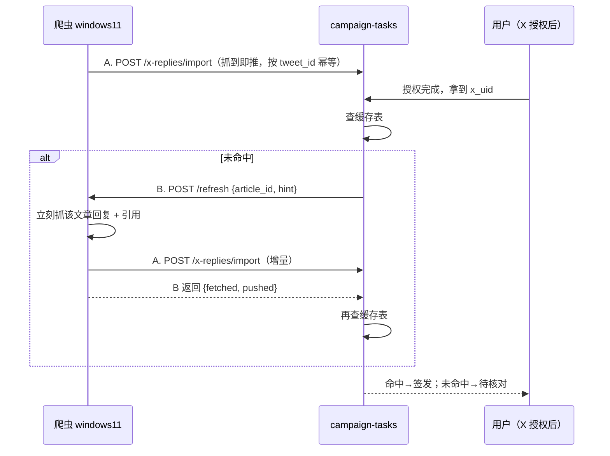

# X 爬虫 ↔ campaign-tasks 同步契约

- 版本：v1.0　日期：2026-09-03　适用：OTun-M 上线活动任务 2「在置顶文章下回复并附截图」
- 双方：**爬虫**（`windows11`，tailnet `100.96.122.49`，Windows）与 **campaign-tasks**（`100.96.107.7:8790`，`tag:tasks`）
- 上下文见《OTun-M上线活动-发放流程.md》§1。本文只定接口，不讲活动规则。

## 0. 一句话

爬虫把「谁在哪篇文章下留了言、有没有图」推给 campaign-tasks（接口 A）；用户授权后没命中时，campaign-tasks 让爬虫立刻再抓一次（接口 B）。两个方向都只走 tailnet，都用同一个共享密钥。



## 1. 通用约定

| 项 | 约定 |
|---|---|
| 协议 | HTTP/1.1，JSON，UTF-8，`Content-Type: application/json` |
| 鉴权 | 请求头 `X-Scraper-Secret: <共享密钥>`，两个方向都带。密钥由 campaign-tasks 侧生成（32 字节随机，hex），线下交给爬虫侧写进配置；**不要出现在对话、issue、代码里**。 |
| 响应信封 | 与 campaign-tasks 现有接口一致：成功 `{"success":true,"data":{...}}`；失败 `{"success":false,"error":{"code":"...","message":"...","retryable":true|false}}` |
| ID 类型 | `tweet_id`、`article_id`、`x_uid` **一律字符串**。X 的雪花 id 超过 2^53，用 number 会丢精度。 |
| 时间 | ISO 8601，UTC，带 `Z`，如 `2026-09-05T08:12:33Z` |
| 网络 | 只走 tailnet。爬虫监听 `100.96.122.49`（不是 127.0.0.1），Windows 防火墙只对 Tailscale 网卡放行。ACL 见 §6。 |
| 请求体上限 | 1 MB |
| 超时 | 接口 A：爬虫等 campaign-tasks 最多 10 s。接口 B：campaign-tasks 等爬虫最多 8 s（见 §3）。 |

## 2. 接口 A（campaign-tasks 提供）：`POST /x-replies/import`

爬虫把抓到的回复与引用推过来。**抓到就推，不攒批**；一次抓取抓到多条可以合成一个请求。

### 2.1 请求

```json
{
  "article_id": "1832000000000000000",
  "source": "scraper-windows11",
  "items": [
    {
      "tweet_id":   "1832100000000000001",
      "kind":       "reply",
      "x_uid":      "44196397",
      "username":   "someone",
      "has_media":  true,
      "created_at": "2026-09-05T08:12:33Z",
      "in_reply_to_tweet_id": "1832000000000000000",
      "text_excerpt": "用了三天，B 站 1080p 不卡…",
      "deleted":    false
    }
  ]
}
```

| 字段 | 必填 | 说明 |
|---|---|---|
| `article_id` | ✅ | 置顶文章（Article 本身也是一条 post）的 id。一次请求只对应一篇文章。 |
| `source` | 建议 | 爬虫实例标识，只用于日志。 |
| `items` | ✅ | 1–500 条。超过分多次。 |
| `items[].tweet_id` | ✅ | 这条回复 / 引用自己的 id。**幂等键**：同一 `(article_id, tweet_id)` 重复推送只更新、不新增。 |
| `items[].kind` | ✅ | `reply`（在文章 conversation 里的任意层级回复）或 `quote`（引用转发）。两种都算。 |
| `items[].x_uid` | 建议 | 作者的数字 id（页面数据里的 `rest_id` / `user_id`）。**有就务必给**：OAuth 拿到的也是这个，匹配最稳。 |
| `items[].username` | ✅ | 作者 handle，不带 `@`。x_uid 缺失时按它匹配（不区分大小写）。 |
| `items[].has_media` | ✅ | 该条自己附带了图片或视频。**链接预览卡不算**，引用的原文里的图不算。 |
| `items[].created_at` | ✅ | 发布时间。 |
| `items[].in_reply_to_tweet_id` | 可选 | 直接回复的目标。只用于运营展示层级，不参与判定。 |
| `items[].text_excerpt` | 可选 | 正文前 200 字，给运营后台看，不参与判定。 |
| `items[].deleted` | 可选 | 爬虫发现这条已被删除时推 `true`。campaign-tasks 把该行标记为无效；**只影响尚未签发的**，已签发的不追回。 |

### 2.2 响应

`200`：

```json
{
  "success": true,
  "data": {
    "accepted": 12,
    "updated": 3,
    "rejected": [
      { "tweet_id": "1832100000000000009", "reason": "MISSING_USERNAME" }
    ],
    "matched_pending": 1
  }
}
```

| 字段 | 说明 |
|---|---|
| `accepted` | 新增入库条数 |
| `updated` | 已存在、本次更新了字段（如 `has_media` 变化、`deleted`）的条数 |
| `rejected` | 单条校验失败，**不影响同批其他条**。`reason` 见 §5。爬虫可记日志，不必重试。 |
| `matched_pending` | 本次推送命中了几个「待核对」用户并触发了自动签发。只是给爬虫侧看的观测值。 |

错误：`401 UNAUTHORIZED`、`400 VALIDATION_ERROR`（整包结构不对，如缺 `article_id`、`items` 非数组、超 500 条）、`413 PAYLOAD_TOO_LARGE`、`500 INTERNAL`（`retryable:true`）。

### 2.3 爬虫侧重试

- `5xx` / 超时 / 连接失败：同一请求体原样重试，退避 2 s → 8 s → 30 s → 2 min，之后每 5 min 一次直到成功。幂等，重复推没有副作用。
- `4xx`：不重试，记日志。`401` 说明密钥不对，停下来报警而不是循环。
- 爬虫重启后把上次未确认成功的批次重推一遍即可，不需要对账。

## 3. 接口 B（爬虫提供）：`POST /refresh`

campaign-tasks 在用户授权后未命中缓存时调用。目的：**让用户在同一个页面上几秒内拿到结果**。建议端口 `8791`，可改，改了告诉 campaign-tasks 侧写进配置。

### 3.1 请求

```json
{
  "article_id": "1832000000000000000",
  "reason": "verify",
  "hint": { "x_uid": "44196397", "username": "someone" },
  "budget_ms": 6000
}
```

| 字段 | 说明 |
|---|---|
| `article_id` | 要抓的文章 |
| `reason` | 固定 `verify`。预留给以后运营手动刷新 `manual`。 |
| `hint` | 正在等结果的那个用户。爬虫**可以**用它提前结束：翻到这个人的留言就不用把整个评论区抓完。也可以完全忽略。 |
| `budget_ms` | campaign-tasks 希望爬虫在这个时间内返回。超过就先返回已抓到的部分，剩下的走正常增量推送。 |

### 3.2 行为要求

1. 收到后立刻对该文章抓一次回复与引用（不等定时周期）。
2. 抓到的新增 / 变化条目**先**通过接口 A 推给 campaign-tasks，**再**返回本接口的响应。这样 campaign-tasks 收到响应时缓存已经是新的。
3. 同步返回，不做异步 job。campaign-tasks 侧最多等 8 s，超时按「本次未命中」处理，不报错。
4. 同一 `article_id` 若 30 s 内已刷新过，可以直接返回 `429`（见下），campaign-tasks 侧本来也有 30 s 冷却，双保险。

### 3.3 响应

`200`：

```json
{
  "success": true,
  "data": {
    "fetched": 37,
    "pushed": 2,
    "hint_found": true,
    "elapsed_ms": 2140,
    "partial": false
  }
}
```

| 字段 | 说明 |
|---|---|
| `fetched` | 本次翻到的条目总数 |
| `pushed` | 本次通过接口 A 推送的新增 / 变化条数 |
| `hint_found` | 传了 `hint` 时，是否在本次抓取里看到了这个人的留言。campaign-tasks 不以它为准，仍以缓存表为准；只用于日志。 |
| `partial` | 因 `budget_ms` 提前返回，评论区没抓完。 |

`429`：`{"success":false,"error":{"code":"COOLDOWN","message":"...","retryable":true},"retry_after_ms":18000}`
`503`：爬虫当前不可用（登录态失效、被限流、正忙）。`{"success":false,"error":{"code":"SCRAPER_UNAVAILABLE","message":"...","retryable":true}}`。campaign-tasks 按未命中处理并在运营面板亮黄灯。

### 3.4 `GET /health`

`200 {"success":true,"data":{"ok":true,"logged_in":true,"last_fetch_at":"…","last_push_at":"…","version":"…"}}`。campaign-tasks 每分钟探一次，用于运营面板显示爬虫状态；连续 3 次失败亮红灯。`logged_in:false` 也算不健康。

## 4. campaign-tasks 侧的判定规则（供爬虫理解字段用途）

- 一条留言**有效** = `kind ∈ {reply, quote}` ∧ `has_media = true` ∧ `deleted ≠ true` ∧ `created_at ≥ 文章发布时间`。
- 一个人只算一次：按 `x_uid` 去重；没有 `x_uid` 的行按 `lower(username)`。命中后 campaign-tasks 把 OAuth 拿到的 `x_uid` 回写到该行，之后不再依赖用户名。
- 匹配顺序：先 `x_uid` 精确匹配，再 `username` 不区分大小写。两者都给时以 `x_uid` 为准；若两者冲突（同一 tweet_id 前后推来的 uid 不同）以最新一次为准并记日志。
- `text_excerpt`、`in_reply_to_tweet_id` 不参与判定，缺失不影响。

## 5. 错误码

| 方向 | HTTP | code | 含义 | 对方怎么处理 |
|---|---|---|---|---|
| A | 401 | `UNAUTHORIZED` | 密钥错 | 停止并报警 |
| A | 400 | `VALIDATION_ERROR` | 整包结构错 | 修请求，不重试 |
| A | 413 | `PAYLOAD_TOO_LARGE` | >1 MB 或 >500 条 | 拆小 |
| A | 500 | `INTERNAL` | campaign-tasks 内部错 | 按 §2.3 重试 |
| A（单条 reason） | — | `MISSING_USERNAME` / `BAD_TWEET_ID` / `BAD_KIND` / `BAD_TIMESTAMP` / `ARTICLE_MISMATCH` | 单条字段问题 | 记日志 |
| B | 401 | `UNAUTHORIZED` | 密钥错 | campaign-tasks 报警 |
| B | 429 | `COOLDOWN` | 30 s 内刷过 | 按未命中，不重试 |
| B | 503 | `SCRAPER_UNAVAILABLE` | 爬虫不可用 | 按未命中，面板亮黄 |

## 6. 网络与配置

**Tailscale ACL**（管理台改，两条新规则）：

```jsonc
"hosts": { "scraper": "100.96.122.49" },
"acls": [
  { "action": "accept", "src": ["scraper"],   "dst": ["tag:tasks:8790"] },
  { "action": "accept", "src": ["tag:tasks"], "dst": ["scraper:8791"] }
]
```

**campaign-tasks `.env` 新增**：

```
X_SCRAPER_SECRET=<32 字节 hex>
SCRAPER_REFRESH_URL=http://100.96.122.49:8791
SCRAPER_REFRESH_TIMEOUT_MS=8000
SCRAPER_REFRESH_COOLDOWN_MS=30000
X_REPLY_ARTICLE_IDS=1832000000000000000        # 逗号分隔，允许多篇
```

**爬虫侧配置**：

```
CAMPAIGN_TASKS_IMPORT_URL=http://100.96.107.7:8790/x-replies/import
X_SCRAPER_SECRET=<同一个值>
REFRESH_BIND=100.96.122.49:8791
```

**Windows 侧**：监听地址不能是 127.0.0.1；防火墙入站规则只作用于 Tailscale 网卡；活动期间关闭休眠。这是个人电脑，触发口不可达是正常情况，campaign-tasks 的「待核对」兜底就是为此保留的。

## 7. 示例

爬虫推送（PowerShell）：

```powershell
$body = @{
  article_id = "1832000000000000000"
  source     = "scraper-windows11"
  items      = @(@{
    tweet_id = "1832100000000000001"; kind = "reply"; x_uid = "44196397"
    username = "someone"; has_media = $true; created_at = "2026-09-05T08:12:33Z"
  })
} | ConvertTo-Json -Depth 5
Invoke-RestMethod -Method Post -Uri "http://100.96.107.7:8790/x-replies/import" `
  -Headers @{ "X-Scraper-Secret" = $env:X_SCRAPER_SECRET } `
  -ContentType "application/json" -Body $body
```

campaign-tasks 触发刷新（Linux）：

```bash
curl -sS -m 8 -X POST http://100.96.122.49:8791/refresh \
  -H "X-Scraper-Secret: $X_SCRAPER_SECRET" -H 'Content-Type: application/json' \
  -d '{"article_id":"1832000000000000000","reason":"verify","hint":{"username":"someone"},"budget_ms":6000}'
```

## 8. 联调与验收

按顺序，每步通过再下一步：

1. **连通**：爬虫机 `curl http://100.96.107.7:8790/health`（campaign-tasks 已有）；campaign-tasks 机 `curl http://100.96.122.49:8791/health`。任一不通先查 ACL / 防火墙 / 监听地址。
2. **推送幂等**：同一条 `tweet_id` 推两次，第二次响应 `accepted:0, updated:0` 或 `updated:1`，库里只有一行。
3. **字段校验**：故意缺 `username` 推一条，响应 `rejected` 里有它，同批其他条正常入库。
4. **刷新**：在文章下用测试 X 号留一条带图回复，不等定时周期，直接调 `/refresh` 带 `hint`，响应 `pushed ≥ 1`，随后缓存表能查到该行。
5. **端到端**：测试 X 号走 OAuth → 命中 → 拿到 claim_link → App 领取到账。再用同一 X 号走一遍，签发口 `reused:true`。
6. **兜底**：把爬虫停掉，OAuth 走一遍，页面显示「待核对」不报错；启动爬虫推送该用户，campaign-tasks 自动签发并通知。
7. **删除**：删掉测试回复，爬虫推 `deleted:true`，尚未签发的用户从有效名单里消失。

## 9. 待爬虫侧确认

- `/refresh` 端口是否用 8791。
- 页面数据里能否稳定拿到作者数字 id（`rest_id`）。能拿到就填 `x_uid`，匹配会稳很多。
- 引用转发（`quote`）是否已在抓取范围内；没有的话先只推 `reply`，契约不变。
- 一次 `/refresh` 抓完一篇文章的评论区通常要多久，用来定 `budget_ms` 默认值。
