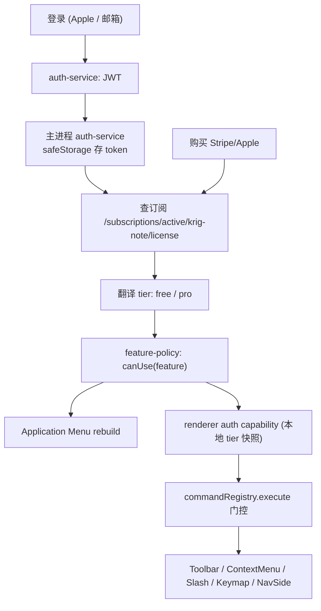

# Authorization Management — 账号登录与服务等级授权设计

> **状态**：设计建议稿（2026-06-15 初稿 → 2026-06-16 按后端文档对齐重写 → 2026-06-17 **本期范围大幅收窄**）
> **范围**：账号登录、订阅状态、付费档位（free/pro）、菜单/命令/IPC 的功能 gate。
> **目标**：在不破坏现有 Electron + Registry + Capability 架构的前提下，为 KRIG Note V2 接入平台统一授权体系（V3 SaaS 平台的一个 `app=krig-note`）。
> **对齐依据**：[KRIG_NOTE_AUTH_AND_BILLING_SUPPORT.md](./KRIG_NOTE_AUTH_AND_BILLING_SUPPORT.md) + 后端 2026-06-17「最终决定通知」。

---

## ★ 2026-06-17 最终决定（覆盖下文大部分内容，先读这个）

**本期不做授权，只做登录 + 归因。** 前后端共同拍板，砍掉「一年免费 grant / 到期判定 / 倒计时 / 验签 / 客户端功能门控」——这些是为还没上线的计费系统提前造的复杂度，计费没来就不造。

### 本期做什么
- 注册 / 登录 / refresh（字段真值见 §六；`app_source=krig-note` **必带**，是归因的根）。
- token safeStorage 加密落盘、AuthGate **硬挡**（未登录不能用）、账号 badge（邮箱 + 登出，**无倒计时**）。
- **客户端逻辑极简**：能登录 = 全功能；401 = 重新登录。没了。

### 本期不做（从代码里删）
- grant 查询（`/me/grants`）、「剩余 N 天」倒计时、Ed25519 验签、离线时钟兜底。
- 阶段 6 的客户端功能门控管线（`feature-policy` / `commandRegistry` gate / `canUse` / `MenuItem.feature` / dev 模拟开关）。
- 「查订阅判 free/pro」（推迟到下期计费）。

### 授权为什么不靠客户端门控（关键认识转变）
原设计把授权收口在「客户端功能门控」，并担心「装了不更新的老用户绕过」。**新认识：授权的真正边界是「后端在登录 / refresh 这一步判定」，不在客户端。** 因为：

1. **AuthGate 硬挡 + 后端登录判定**：app 未登录不能用；下期计费时，后端在登录这一步判「有无有效订阅」，没订阅就不让登录成功——这道门在后端，是真权威，**不依赖客户端有没有门控代码**。
2. **30 天 refresh 强制收口不更新的老用户**：access 24h / refresh 30d，客户端到期必须 refresh（已实现）。下期后端在 refresh 处拒绝未付费账号 → token 过期 → 回登录页 → 又被拦。**最多 30 天，所有老用户（含装了不更新的）自动被后端收口**，无需客户端门控、无需强制更新。
3. 这比客户端门控强：客户端门控是软锁（本机用户可改代码绕过），「后端拒绝 refresh」是硬锁。

**因此客户端功能门控（阶段 6）在本方案下是多余的，删除。** 下文 §三/§七/§八.5 关于 entitlement/canUse/门控收口的内容**已被本决定取代**，仅作历史设计记录保留，本期不实现。

---

## 〇、本次重写的关键校正（先读这个）

初稿基于「客户端自持 `entitlements[]` 数组 + 五档 tier 矩阵 + OAuth `krig-note://` 自定义协议」的假设。后端文档落地后，这些假设大部分**不成立**，已据实重写。差异如下：

| 维度 | 初稿假设 | 后端实际（权威） |
|---|---|---|
| 授权模型 | 客户端持 `entitlements[]` 数组，policy 矩阵展开 | **无 entitlement 概念**；后端只给「有无有效 `krig-note/license` 订阅」→ 客户端解析为 `free` / `pro` 二态 |
| 档位 | guest/free/pro/team/admin 五档 | **初期只有 `free` / `pro` 两档**（team 等后续加，仅多配 SKU） |
| 登录 | OAuth + `krig-note://auth/callback` 自定义协议 | **JWT**：商店版 Sign in with Apple、官网版邮箱验证码；Bearer token，无需自定义协议 |
| 授权来源接口 | 自拟 `GET /license/entitlements` | `GET /api/subscriptions/active/krig-note/license`（或聚合 `GET /api/v1/me`），全走 `portal.situstechnologies.com` 相对路径 |
| 功能边界由谁定 | 客户端 entitlement 矩阵 | **纯客户端 gate**（后端文档 §8 D3：「免费档 vs pro 的功能边界产品定，后端不关心」） |
| 信任边界 | 初稿担心客户端 entitlement 可伪造 | 后端确认付费判定是**软态**（无 license_key、无设备绑定、无服务端签名校验客户端态）；详见本文 §三 |

**最重要的一条结论**：后端**不用客户端的功能门控来鉴权**。后端只持有「订阅真源」（这个用户付没付费，由 Apple/Stripe 验单决定，权威在后端）。客户端把「付没付费」翻译成「哪些功能可用」——这一翻译是**纯 UX 软门控**，技术上锁不死本机用户，**也不需要锁死**（见 §三）。这反而大幅简化了客户端：不需要 entitlement 防篡改、不需要 `secureHandle` 当安全边界。

---

## 一、结论

授权不应实现为"菜单是否可用"的孤立逻辑。

菜单只是功能入口之一。当前 app 里同一个功能可能从 Application Menu、Toolbar、ContextMenu、SlashMenu、Keymap、NavSide、renderer command、preload API、main IPC 多条路径触发。如果只控制系统菜单，用户仍可能通过 toolbar、快捷键或直接调用 `window.electronAPI` 绕过——所以**功能门控要在统一收口处做，而不是逐入口贴**。

推荐模型（对齐后端后）：

```
账号登录（JWT）
  ↓
查订阅状态（后端权威：有无有效 krig-note/license 订阅）
  ↓
PlanTier：'free' | 'pro'
  ↓
客户端 feature gate（纯 UX 软门控，功能边界产品定）
  ↓
统一控制：
  - Application Menu 显示 / 禁用
  - renderer 菜单 / toolbar / slash / keymap 显示 / 禁用
  - commandRegistry 执行前 gate
  - ViewSwitcher / NavSide 显示
```

**核心原则**：以「档位 → 功能集」做门控，以菜单状态表达；不要以菜单本身作为门控事实来源，也不要把客户端门控当成安全边界。

---

## 二、商业模型与档位（来自后端文档）

| 维度 | KRIG-Note 取值 |
|---|---|
| 商业模式 | Freemium（注册即免费档，**无 trial**） |
| 平台 `app` | `krig-note` |
| `service_type` | `license`（纯软件授权，无 VPN/VPS 资源） |
| 档位 | `free`（隐式，不落订阅）/ `pro`（初期唯一付费档，月+年） |
| 分发渠道 | Windows/官网版 = Stripe；macOS 商店版 = Apple IAP；按 **email 统一账号** |
| 登录 | 商店版 Sign in with Apple；官网版邮箱注册/登录 |
| 授权判定 | 读订阅状态（后端文档 §5 方案 A） |

> **跨平台提醒**：本 app 同时构建 Windows（Squirrel）与 macOS（forge.config.ts 确认）。所以登录/购买**不能只走 Apple**：Windows 用户走官网邮箱登录 + Stripe Checkout。客户端要按运行平台/分发渠道选择登录入口（见 §六）。

---

## 二·补、分阶段商业化：测试期全免费 + 注册兜底（产品策略）

> 这是总指挥的核心构思，优先级高于「立刻分 free/pro」。功能分档（见 [feature-tier-decision-table.md](./feature-tier-decision-table.md)）是为**一年后**准备的；**当前阶段先全免费**。

### 二·补.1 策略

1. **测试期全功能免费**：让用户尽量用、给反馈。客户端**不分档**（所有 feature 视为可用）。
2. **仍然要求注册**：注册的目的**不是现在收费，而是为未来授权兜底**——账号是「免费授权何时到期」的锚点。
3. **一年期免费授权（grant）**：用户登录后获得一个**为期一年的免费授权**。一年后该 grant 到期，app 才进入正式计费模型（按功能分档表决定 free/pro）。
4. **一年后统一切计费，不依赖用户更新客户端**。

### 二·补.2 为什么「到期时间必须由后端按账号记录」（关键决策，总指挥已拍板）

总指挥的真实担忧：**怕用户装了第一版后从此不更新、永久白嫖第一版**。要兜住这个场景，「一年免费」的到期时间**必须记在后端账号上，不能记在客户端本地**：

| 方案 | 能否兜住「装了不更新/不联网」的用户 |
|---|---|
| ❌ 客户端本地记一年 | **不能**。该用户本就不联网/不更新，本地时钟由他说了算（改系统时间续命），新策略也推不到他。注册形同虚设。 |
| ✅ 后端按账号发 grant，客户端启动查 | **能**。到期时间是后端权威，改本机时钟无效；一年后后端统一切计费，与客户端版本无关。 |

**结论**：grant 到期时间是**后端权威**。客户端启动时带 JWT 问后端「我这个账号的免费授权到什么时候 / 现在是 free 还是 pro」，本地只做离线兜底缓存（见 §九）。

> 副作用（正面）：这套机制让「免费策略」完全由后端掌控——你随时能在后端延长测试期、给特定用户续期、或切计费，全部不用发客户端版本。

### 二·补.3 ⚠️ 这需要后端新增能力（后端文档未覆盖，待确认）

后端现有文档（KRIG_NOTE_AUTH_AND_BILLING_SUPPORT.md）讲的是 **Freemium 订阅模型**（Apple/Stripe 验单 → 订阅真源），**没有「按账号发一年期免费授权 grant」这种东西**。本策略引入新的后端需求，**实施前必须与后端确认**：

1. 后端能否在账号上记录一个 **`free-grant` 授权及其 `expiresAt`**（如注册时自动发一年）？
2. 客户端用什么接口查到它？是复用 `GET /api/v1/me` / `GET /api/subscriptions/active/krig-note/license` 让它把 grant 也算进「有效授权」，还是新增一个查询？
3. grant 与正式订阅的关系：grant 期内即「全功能」；grant 到期后回落到「按订阅判定 free/pro」。后端如何表达这两个阶段？
4. grant 到期时间是否**带服务端签名**，让离线兜底也不可被本机改时钟绕过？（见 §九）

> 在后端确认前，客户端可按「**effectiveTier = grant 有效 ? 'pro-equivalent(全功能)' : 读订阅**」的抽象实现，把 grant 查询藏在 `resolveTier()` 内部（见 §七），后端落地后只替换该函数的数据来源，不动上层门控。

### 二·补.4 客户端在测试期的行为

- 登录后 `resolveTier()` 若发现「grant 有效」→ 返回全功能态（等价 pro），所有 feature 解锁。
- UI 上可显示「测试版 · 免费授权剩余 XXX 天」，到期前提示。
- 一年后 grant 失效 → `resolveTier()` 自动转为读订阅 → 未付费用户回落 free（按分档表），无需改客户端代码。

> ⚠️ **关键前提（否则整个兜底失效）**：要让「用户不更新也能在一年后被切到计费」成立，**门控代码（Phase 2）必须在测试期就随版本铺到用户机器上**。如果门控逻辑拖到 grant 快到期才发版，那些「装了不更新」的用户机器上根本没有门控代码，grant 失效也无从限制——又回到了你担心的场景。所以实施顺序是：测试期就把「登录 + grant 查询 + 完整门控管线」全部上线（只是 grant 期内不开闸），购买 UI 可延后。见 §十 Phase 排序。

---

## 三、信任边界（决定客户端要做多重的门控）

后端文档 §8 D3 明确：**功能边界是纯客户端 gate，后端不关心**；§5 方案 A 也确认不发 license_key、不做设备绑定、不对客户端态做服务端签名校验。这意味着：

- 客户端的「`free`/`pro` 判定」依据是**联网查来的订阅状态**。订阅是否有效，权威在后端（Apple/Stripe 验单 + subscription-service 仲裁），**这部分伪造不了**（要破 JWT / 中间人，HTTPS 已挡）。
- 但「订阅状态 → 哪些功能解锁」的翻译发生在客户端本地，**机器主人能改本地代码/缓存绕过**。这是**可接受的软门控**——note 类 SaaS 的盗版对抗价值低，后端已选择不投入（方案 A vs B 的取舍）。

**因此客户端不需要、也无法把功能门控做成安全边界。** 真正值钱的「付没付费」由后端订阅态守住；客户端只负责把它**忠实、即时、一致地**反映到所有功能入口上（fail loud、引导升级）。

> 与初稿的区别：初稿设计了 `secureHandle` 在主进程 IPC 拦截，并称其为"真正安全边界"。在当前后端模型下，**主进程 IPC 门控仍有价值（统一收口、防误用、UX 一致），但它不是安全边界**——付费内容（AI 等）的真正保护在后端那一侧的 token 鉴权与计量，不在客户端 IPC。客户端 IPC 门控按「软门控 + 防呆」对待即可。

---

## 四、现有架构事实（客户端，已核对代码）

### 4.1 主进程启动与 IPC

- `src/platform/main/index.ts`
- `src/platform/main/ipc/ipc-bus.ts`
- `src/platform/main/preload/main-window-preload.ts`

renderer 通过 preload 暴露的 `window.electronAPI` 调用主进程 IPC。业务能力以 `ipcMain.handle(...)` 直接注册（无统一 wrapper），分布在各 capability 的 `handlers.ts`：note / folder / pm-content、ebook、web / proxy / download、ai、x、media、backup / import。

### 4.2 HTTP 与配置

- 主进程已用 Electron `net` 模块发请求（见 `src/platform/main/extraction/upload-service.ts`），**不是 fetch/axios**。新增 auth 的网络调用沿用 `net`。
- 已有配置模块范式：`src/platform/main/extraction/config.ts` 用硬编码常量集中管理 API base（如 `PLATFORM_API`）。auth 的 portal base URL 应同样集中到一个 config 模块，**便于切环境（dev/prod）**，不要散落。
- 外部 URL 打开已具备：主窗口 `setWindowOpenHandler` + `shell.openExternal`，preload 已暴露 `openExternal(url)`。**登录/购买（Stripe Checkout、Apple 授权页）直接复用 `openExternal`，无需自定义协议。**

### 4.3 系统菜单

`MenuRegistry`（`src/slot/menu-registry/menu-registry.ts`、`menu-types.ts`、`src/platform/main/menu/framework-menus.ts`）。已确认 `rebuild(): void` 存在。当前 `MenuItem`：

```ts
interface MenuItem {
  id: string;
  label: string;
  command?: string;
  accelerator?: string;
  separator?: boolean;
  submenu?: MenuItem[];
}
```

缺 `enabled` / `visible` / 门控字段，需扩展（见 §八）。

### 4.4 renderer 命令与交互入口

- 命令中心 `src/slot/command-registry/command-registry.ts`：`register(id, handler)`、`execute(id, ...args): unknown`（**同步返回**）。
- 交互注册中心：toolbar-registry、context-menu-registry、slash-registry、keymap-registry（`keymap-listener.ts` 已确认匹配后调 `commandRegistry.execute(binding.command)`）、nav-side-registry。
- `ViewDefinition`（`src/slot/view-type-registry/view-definition.ts`）含 install/navSideTab/toolbar/slash/keymap 等组合声明。

### 4.5 当前没有账号/订阅模型

代码里无任何 auth/login/session/license/subscription 实现（已全局搜索确认）。`user:krig:*` 是数据语义 predicate，不是账号系统。存储层是本机 SurrealDB sidecar（`src/storage/`）。需新增独立 auth 模块。

---

## 五、客户端核心模型（对齐后端，极简）

不再有 `entitlements[]` 数组，也不再有 policy 矩阵展开。客户端状态收敛为：

```ts
type AuthStatus =
  | 'loading'        // 启动中,尚未从磁盘恢复/尚未查到订阅
  | 'anonymous'      // 未登录
  | 'authenticated'  // 已登录(免费档也是这个状态)
  | 'token-expired'; // token 失效需重新登录(区别于订阅过期)

type PlanTier = 'free' | 'pro';   // 初期两档,后续可加 'team'

interface AuthAccount {
  id: string;        // auth.users.id (UUID),平台账号主键
  email: string;
  name?: string;
  avatarUrl?: string;
}

interface AuthState {
  status: AuthStatus;
  account?: AuthAccount;
  tier: PlanTier;             // 由订阅状态翻译而来
  subscription?: {            // 订阅快照(用于 UI 展示与离线兜底)
    status: 'active' | 'expired' | 'none';
    currentPeriodEnd?: number;  // 来自后端,展示/离线兜底用
    channel?: 'apple' | 'stripe';
  };
  lastVerifiedAt?: number;
}
```

> 注意：**`tier` 不直接散落在业务代码里写 `if (tier === 'pro')`**。客户端维护一份「功能 → 最低档位」映射（见 §七），业务入口只问 `auth.canUse(featureKey)`。这是初稿里唯一保留的好原则：业务入口认 feature，不认 tier 字面值。

---

## 六、登录与购买流程（对齐后端，无自定义协议）

### 6.1 登录

> **接口字段以后端核实真值为准**（见 [实现计划 §1.1](./tasks/2026-06-16-auth-register-test-grant-impl-plan.md)）。关键纠正：验证码字段是 **`code`**（非 `verification_code`，6 位）；**`device` 是嵌套对象**；**`app_source` 顶层**；token 有效期读响应 `expires_in`（别硬编码）；`X-Request-ID` 后端不强制（非幂等键）。

按平台/渠道分两条入口，前端都要带顶层 `app_source=krig-note` + `device.device_type`（`macos`/`windows`）：

```
[官网版 / Windows]                         [Mac App Store 版,下期]
邮箱注册:                                   Sign in with Apple:
  POST /api/v1/auth/code {email,purpose}     POST /api/v1/auth/apple
  POST /api/v1/auth/register {email,
       password,code,device,app_source}
邮箱登录:
  POST /api/v1/auth/login {email,
       password,device,app_source}
        ↓                                          ↓
   AuthResponse: access_token + refresh_token + expires_in + user
        ↓
   主进程 safeStorage 加密保存 token
        ↓
   查 grant(测试期) / 订阅(下期) → 翻译 tier → 广播 auth.changed → 菜单 rebuild + UI 刷新
```

- **JWT 用法**：之后所有认证请求带 `Authorization: Bearer <access_token>`。401 时调 `POST /api/v1/auth/refresh`（轮换式，**旧 refresh 被撤销，必须存新返回的那个**）。refresh 失败区分：HTTP 401 = 重新登录；网络/5xx = 可重试。
- **同邮箱跨渠道合并**对 krig-note 生效（auth 三层防重），用户用同一邮箱即可。
- **免费档也要登录**（后端文档 §2.3）：「免费」是功能档位不是匿名。客户端逻辑：**先登录 → 测试期查 grant 全功能 / 下期查订阅决定 free/pro**。未登录主路径是引导登录。

### 6.2 购买

| 渠道 | 流程 |
|---|---|
| Stripe（官网/Windows） | `POST /api/stripe/checkout/session` 拿 `url` → `shell.openExternal(url)` 打开浏览器付款 → 付完回到 app **主动重查订阅**刷新 UI |
| Apple IAP（商店版 macOS） | StoreKit 购买 → 把 transaction/receipt 交 `POST /api/apple/*` 验单 → 重查订阅 |

续期/过期/退款由后端监听 Apple/Stripe 通知自动处理，**客户端不轮询续期**，只在「启动 / 恢复前台 / 购买完成」时重查。

### 6.3 接口清单（全走 `portal.situstechnologies.com` 相对路径）

| # | 能力 | 接口 |
|---|---|---|
| 1 | 商店版登录 | `POST /api/v1/auth/apple` |
| 2 | 官网版注册 | `POST /api/v1/auth/code` → `POST /api/v1/auth/register` |
| 3 | 官网版登录 | `POST /api/v1/auth/login` |
| 4 | Token 刷新 | `POST /api/v1/auth/refresh` |
| 5 | 当前用户(聚合,含订阅) | `GET /api/v1/me` |
| 6 | Apple 验单 | `POST /api/apple/*`（实施时确认路径） |
| 7 | Stripe 下单 | `POST /api/stripe/checkout/session` |
| 8 | **付费判定(核心)** | `GET /api/subscriptions/active/krig-note/license` |
| 9 | 设备列表(可选软提示) | `GET /api/v1/auth/devices` |

> 不直连任何独立域名/IP/端口；本地开发用代理到 portal（后端文档 §6）。

---

## 七、付费判定与功能映射（纯客户端 gate）

### 7.1 判定逻辑（grant 优先 → 再读订阅）

判定分两步：**先看测试期免费 grant 是否有效（§二·补），有效则全功能；否则读订阅判 free/pro。** 把这两步都藏在 `resolveTier()` 内部，上层门控只认返回的 tier，后端 grant 接口落地后只改本函数：

```ts
// 主进程:每次启动 & 恢复前台 & 购买完成时调
async function resolveTier(): Promise<'free' | 'pro'> {
  // 步骤 1:测试期免费 grant(后端权威记录,待后端确认接口 — §二·补.3)
  //   grant 有效期内 = 全功能,等价 pro
  const grant = await fetchFreeGrant(bearer);          // 待后端接口;可先并入 /me
  if (grant?.active) return 'pro';                      // 测试期:全功能

  // 步骤 2:grant 失效后,读正式订阅(后端文档 §5.3)
  const res = await netGet('/api/subscriptions/active/krig-note/license', bearer);
  if (res.status === 401) { await refresh(); return resolveTier(); }
  if (!res.ok) return 'free';                           // 无订阅 / 404 = 免费档
  const sub = await res.json();
  return sub?.status === 'active' ? 'pro' : 'free';     // 以后端 effectiveStatus 为准
}
```

- **永远以接口返回的 status 为准**，不本地推算过期（后端 §4.2：DB status 是快照，对外走 `effectiveStatus()` 读时计算）。grant 到期时间同理以后端为准。
- **离线兜底**（体验，非授权依据）：缓存上次 `tier + grant.expiresAt / currentPeriodEnd`；离线且未过期暂沿用，联网后以服务端纠正。**若后端能下发带签名的过期时间，离线兜底也防改时钟绕过**（§九、§二·补.3 Q4）。
- 测试期内 `grant.active` 恒真 → 全部用户全功能；一年后 grant 失效，自动落到步骤 2 的订阅判定，**无需改客户端代码**。

### 7.2 功能 → 最低档位映射（客户端维护，产品定边界）

后端不关心这张表（§8 D3）。客户端用一张**简单的 `feature → minTier` 映射**，不需要初稿那套 entitlement 通配符/依赖闭包：

```ts
type FeatureKey =
  | 'note.read' | 'note.write' | 'note.import'
  | 'web.browser' | 'web.bookmark' | 'web.download' | 'web.proxy'
  | 'ebook' | 'ai.ask' | 'ai.extract' | 'ai.sync' | 'media.store'
  | 'x.view' | 'x.extract' | 'x.publish' | 'backup';

const FEATURE_MIN_TIER: Record<FeatureKey, PlanTier> = {
  // 初步建议(产品最终拍板):本地功能尽量 free,后端有成本的压 pro
  'note.read': 'free', 'note.write': 'free', 'note.import': 'free',
  'web.browser': 'free', 'web.bookmark': 'free', 'web.download': 'free',
  'web.proxy': 'free', 'ebook': 'free', 'media.store': 'free',
  'x.view': 'free', 'x.extract': 'free', 'backup': 'free', 'ai.sync': 'free',
  // pro:后端有真实成本/价值的
  'ai.ask': 'pro', 'ai.extract': 'pro', 'x.publish': 'pro',
};

function canUse(f: FeatureKey, tier: PlanTier): boolean {
  return tier === 'pro' || FEATURE_MIN_TIER[f] === 'free';
}
```

> **这张表的权威来源是 [feature-tier-decision-table.md](./feature-tier-decision-table.md)**——上面列全了产品功能、锁定强度，由总指挥逐行制定档位策略。代码里的 `FEATURE_MIN_TIER` 是它的投影，决策表改了再同步过来。上面 ts 里的取值仅是占位示例，不是最终决定。
>
> **付费墙放哪**（决策原则）：参考 §三，纯本地功能（导入/备份/代理/书签）客户端锁不住且伤体验，建议留 free；把 `pro` 压在后端有成本的 AI 调用、（若走后端代发的）X 发布上。这张表是产品决策，**改它不用动后端**，也不用发版即可调（若做成可远程下发更佳，见下）。
>
> **测试期注意**：当前阶段（§二·补）所有功能全免费，`FEATURE_MIN_TIER` **暂不生效**（`resolveTier()` 在 grant 有效期内恒返回全功能）。这张表是为一年后 grant 到期、进入正式分档准备的。

> **可选增强**：把 `FEATURE_MIN_TIER` 做成「优先用后端 `/me` 下发、本地表兜底」，这样调整功能边界连客户端发版都省。但后端文档 §8 D3 说后端不管功能边界，所以初期就用客户端硬表，简单可控。

---

## 八、客户端门控落地

### 8.1 模块结构（建议）

```
src/shared/auth/
└── auth-types.ts            # AuthState/PlanTier/FeatureKey 等共享类型

src/platform/main/auth/
├── auth-config.ts           # portal base URL(仿 extraction/config.ts),dev/prod 切换
├── auth-store.ts            # safeStorage 加密保存/读取 token(见 §九)
├── auth-service.ts          # login/logout/refresh/resolveTier/getState/subscribe
├── auth-client.ts           # 基于 electron net 的 portal HTTP 客户端(Bearer/X-Request-ID)
├── feature-policy.ts        # FEATURE_MIN_TIER + canUse()
└── handlers.ts              # 注册 auth IPC + auth.changed 广播

src/capabilities/auth/        # renderer
├── index.ts                 # auth.getState/canUse/login/logout/openUpgrade/subscribe
├── use-auth-state.ts        # React hook,订阅 auth.changed,持本地 tier 快照
└── AuthGate.tsx             # 按 canUse 控制 UI 显示/禁用/引导升级
```

### 8.2 IPC channel（仿 `channel-names.ts` 风格：常量 SCREAMING_SNAKE → kebab 值）

```ts
AUTH_GET_STATE:       'auth.get-state',
AUTH_LOGIN_START:     'auth.login-start',     // 触发渠道登录(打开浏览器/Apple)
AUTH_LOGIN_COMPLETE:  'auth.login-complete',
AUTH_LOGOUT:          'auth.logout',
AUTH_REFRESH_TIER:    'auth.refresh-tier',    // 重查订阅
AUTH_OPEN_CHECKOUT:   'auth.open-checkout',   // Stripe/Apple 购买
AUTH_CHANGED:         'auth.changed',         // main → renderer 广播
```

### 8.3 preload API（仿 main-window-preload.ts 风格：camelCase；订阅返回取消函数）

```ts
authGetState(): Promise<AuthState>
authLoginStart(channel: 'web' | 'apple'): Promise<{ ok: boolean; error?: string }>
authLogout(): Promise<void>
authRefreshTier(): Promise<AuthState>
authOpenCheckout(period: 'monthly' | 'yearly'): Promise<{ ok: boolean; url?: string }>
onAuthChanged(cb: (state: AuthState) => void): () => void
```

> renderer **永远只拿 public state（含 tier，不含 token）**。

### 8.4 系统菜单门控

扩展 `MenuItem`，加 feature 门控字段：

```ts
interface MenuItem {
  // ...原字段...
  feature?: FeatureKey;
  locked?: 'disabled' | 'hidden' | 'upsell';  // 无权限时表现
}
```

`MenuRegistry.rebuild()` 构建模板时：

1. 无 `feature`：保持现状。
2. `canUse` 为 true：正常 `enabled: true`。
3. 不可用 + `hidden`：过滤该 item。
4. 不可用 + `disabled`：显示但 `enabled: false`。
5. 不可用 + `upsell`：显示，点击打开升级/账号页。

`auth.changed`（含登录、登出、tier 变化）后 → `menuRegistry.rebuild()`。

### 8.5 renderer 入口统一门控

- `commandRegistry`：**保持 `execute` 同步**（已确认它同步、被 keymap/toolbar 同步调用）。给 `register` 加可选第三参 `{ feature?, locked? }`；`execute` 内同步查 `auth.canUse(feature)`（查**本地 tier 快照**，不跨 IPC）：

```ts
execute(id, ...args) {
  const cmd = this.commands.get(id);
  if (!cmd) return undefined;
  if (cmd.feature && !auth.canUse(cmd.feature)) {
    auth.onLocked(cmd.feature, cmd.locked);  // disabled→无操作 / upsell→开升级页
    return undefined;
  }
  return cmd.handler(...args);
}
```

> keymap 已统一经 `commandRegistry.execute`（已确认 keymap-listener.ts），所以**只改 execute 即覆盖 keymap/toolbar/任何走 command 的入口**——这是初稿正确且应保留的收口优势。

- toolbar / context / slash item：加 `feature?` / `locked?`，渲染时统一过滤或禁用。
- `ViewDefinition` 加 `feature?`：高级 view（如 AI 写作面板入口）显示但进入引导升级；核心 view 不隐藏。

### 8.6 多 ws 广播扇出守卫（已知 bug 家族）

本 app「每 ws 一个常驻 view 实例共享宿主 IPC」，主进程广播会被 N 个实例各消费一次。`auth.changed` 必须：

- 主进程遍历**所有** BrowserWindow / webContents 发送；
- renderer 监听器加 `getActiveId` 守卫，避免一次登录触发 N 次菜单/UI 重建。

### 8.7 冷启动 loading 态

启动时 menu rebuild / view 安装 / registry 注册与「从磁盘恢复 token + 查订阅」并行。`AuthState.status='loading'` 期间：

- UI **不要**先把付费入口灰掉再闪回（已付费用户体验差）。loading 期保持乐观可见；真正 `execute` 时若仍未就绪，短暂 await 一次 tier 解析。
- 离线兜底（§7.1）让 loading→已知 tier 的过渡尽量快。

---

## 九、本地 session 安全

### 9.1 存储

```
{userData}/krig-data/auth/session.json
```

token 用 Electron `safeStorage` 加密（项目当前无 safeStorage 用法，此为新增；userData/krig-data 路径范式已在 ebook/download 等模块使用，沿用）。

```ts
interface StoredAuthSession {
  encryptedAccessToken: string;
  encryptedRefreshToken: string;
  accountId: string;
  email: string;
  // tier 不持久化为权威值,仅缓存最近一次 + currentPeriodEnd 供离线兜底
  cachedTier?: PlanTier;
  currentPeriodEnd?: number;
  lastVerifiedAt: number;
}
```

renderer 永远只拿 public state，不拿 token。

> 提醒：`safeStorage` 只防别的程序偷读，不防本机用户自己改（见 §三）。这对**付费门控无影响**（门控本就是软态），对 **token 机密性有意义**（防同机其他程序窃取 token 冒用账号）。

### 9.2 离线策略

- 已登录、本地有 token、上次查到 `pro` 且 `now < currentPeriodEnd`：离线时暂当 `pro`（体验兜底）。
- token 自身过期（30d refresh 也过）：`token-expired`，引导重新登录。
- 订阅过期（后端返回非 active）：降级 `free`，本地数据仍可读，只关付费功能入口。
- **无需 OBox 那种"过期回收云资源"逻辑**：KRIG-Note 纯软件无云成本（后端文档 §4.3）。

---

## 十、实施阶段

> 排序按总指挥策略：**测试期先上线「注册 + 一年免费 grant」，功能分档与购买闭环延后到接近 grant 到期再做。** 早期投入集中在登录与状态骨架，门控代码先搭好但不真正限制（grant 期内恒全功能）。

### Phase 1（测试期上线）：登录 + grant 兜底

- 新增 `src/shared/auth` 类型、`src/platform/main/auth` 模块（config/store/service/client）。
- 接 auth-service 登录（先做官网邮箱一条，覆盖 Windows + 通用）、token safeStorage、refresh。
- `resolveTier()` 实现 grant 优先逻辑（§7.1）：**grant 有效 → 全功能**。grant 接口待后端确认（§二·补.3），未就绪前可临时让 `resolveTier()` 恒返回全功能 + 显示「测试版」。
- 新增 auth IPC + preload + renderer `use-auth-state`，显示登录状态与「免费授权剩余天数」。
- **此阶段全功能开放，不接任何真实门控**——这是测试期的目标态。

### Phase 2（门控管线搭建，但不开闸）：功能门控收口

- `feature-policy.ts` 落 `FEATURE_MIN_TIER`（取值来自 [feature-tier-decision-table.md](./feature-tier-decision-table.md)）。
- 扩展 `MenuItem` + `MenuRegistry.rebuild()` 接 `canUse`，`auth.changed` 后 rebuild（含多 ws 扇出守卫）。
- `commandRegistry.execute` 同步门控；toolbar/context/slash/keymap 随之受控。
- ViewSwitcher / NavSide 接 view feature。
- 因 grant 期内 `resolveTier()` 恒全功能，**这套门控此时静默无副作用**——可在测试期就合入并验证「登出/模拟 free 态时确实限制」，但不影响真实用户。

### Phase 3（接近 grant 到期前）：付费判定与购买闭环

- 接 `GET /api/subscriptions/active/krig-note/license`（或 `/me`）解析订阅 tier（grant 失效后的步骤 2）。
- 启动 / 恢复前台 / 购买完成时重查；离线兜底缓存。
- Stripe Checkout（`openExternal`）→ 回 app 重查；macOS 商店版接 Apple Sign-in + StoreKit + 验单。
- 升级页 / 账号页 UX；grant/订阅过期、重新登录提示。
- renderer 显示 free/pro 与升级入口。

> 关键：grant 到期那一刻，是**后端**把 grant 标记失效，客户端 `resolveTier()` 自动落到订阅判定——**不需要发新客户端版本**（正是 §二·补.2 要解决的「用户不更新」问题）。前提是 Phase 2 的门控管线已在测试期随版本铺到了所有用户机器上。

---

## 十一、验收清单

1. 未登录启动 app，引导登录；基础只读可用（或按产品定的匿名策略）。
2. 登录免费账号，free 功能立即可用，菜单刷新为 free 态。
3. 升级到 pro（Stripe/Apple）后重查订阅，AI 等 pro 入口立即解锁。
4. 点击 pro 功能而当前 free：出现升级入口，不静默失败（fail loud）。
5. 登出后，pro 入口立即回落，token 本地清除。
6. 快捷键 / 右键 / slash / toolbar / 系统菜单对同一功能表现一致（同一收口）。
7. 离线但 `now < currentPeriodEnd`：保持 pro 体验；联网后以服务端纠正。
8. 订阅过期（后端返回非 active）：降级 free，本地数据仍可读。
9. token 过期：进入 `token-expired`，清晰引导重新登录。
10. 多 ws / 多窗口下，单次登录只触发一次菜单/UI 重建（无 N 次扇出）。
11. Windows 构建走官网邮箱 + Stripe；macOS 商店版走 Apple——两条登录入口都通。

---

## 十二、风险与约束

1. **不要只改菜单**：toolbar/context/slash/keymap/navside/direct command 都要经统一收口（`commandRegistry.execute`）。
2. **不要在 renderer 保存 token**：token 只在主进程 + `safeStorage`；renderer 只拿 public state。
3. **不要 `if (tier === 'pro')` 散落**：业务入口只问 `auth.canUse(featureKey)`。
4. **客户端门控不是安全边界**：付费内容的真正保护在后端订阅/计量；客户端门控是 UX 软态（§三）。别为它投入逆向对抗成本。
5. **登录状态变化必须广播**到主进程菜单 + renderer UI，且做多 ws 扇出守卫。
6. **付费功能 fail loud**：明确告知需要登录还是升级，给可点击入口。
7. **跨平台分渠道**：Apple 仅商店版；Windows/官网走 Stripe。登录入口按平台选择。
8. **全走 portal 相对路径**，base URL 集中到 auth-config，dev/prod 可切，不硬编码散落。

---

## 十三、最终架构图



---

## 十四、落地原则

1. 先建登录 + 订阅判定，再接功能门控 UI。
2. UI 门控是 UX；付费保护的事实源在后端订阅态。
3. 业务入口只认 feature，不认 tier 字面值。
4. 登录/订阅变化必须广播到主进程菜单与 renderer，且防多 ws 重复扇出。
5. 付费功能默认 fail loud：告知缺什么、该登录还是升级。
6. 所有平台/环境的网络调用统一走 portal 相对路径，base 集中可切。
