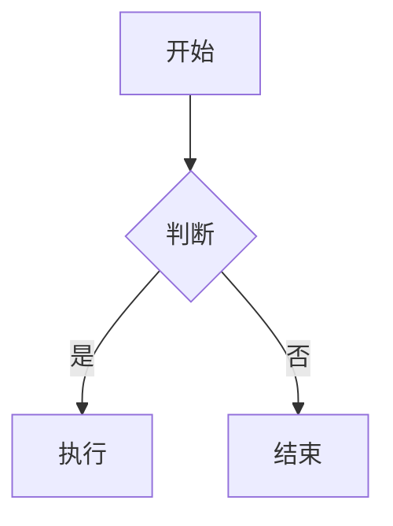

# X Article 发布全覆盖测试文档

> 用途:把这篇导入(拖进 note,或新建 note 对照手建)做「发布为 X 文章」全链路实测。
> 覆盖驱动器所有 step 类型:html(标题/段落/列表/引用/富格式)+ latex + code + table + divider + media（图）。
> 导入后首行「X Article 发布全覆盖测试文档」会成为标题(isTitle)→ 驱动填进 Article 标题框。
> tweetBlock(嵌推)无法用 markdown 表达 —— 需在 note 里右键某条推「提取到笔记」生成,单独测。
> mermaid 用 ```mermaid 代码块表达(走渲图兜底 Media)。

## 一级测试:富文本格式（走 html step 批量粘贴）

这是一个普通段落，包含 **加粗**、*斜体*、~~删除线~~ 和 [一个链接](https://x.com)。X Article 应保留这些富格式。

### 二级标题

下面是无序列表：

- 列表项一
- 列表项二，带 **加粗**
- 列表项三

有序列表：

1. 第一步
2. 第二步
3. 第三步

> 这是一段引用 blockquote。
> 第二行引用。

---

## 二级测试:块级公式（走 latex step → X 原生 LaTeX）

下面是质能方程，应被驱动进 X 的 LaTeX 模态：

$$E = mc^2$$

高斯积分：

$$\int_{-\infty}^{\infty} e^{-x^2} dx = \sqrt{\pi}$$

波动方程：

$$\frac{\partial^2 u}{\partial t^2} = c^2 \frac{\partial^2 u}{\partial x^2}$$

## 三级测试:行内公式

这段文字里有行内公式 $a^2 + b^2 = c^2$，以及另一个 $\sum_{i=1}^{n} i = \frac{n(n+1)}{2}$，它们应该跟随文字段落处理（行内公式当前并入文本流）。

## 四级测试:代码块（走 code step → X 原生 Code）

Python 示例：

```python
def hello(name):
    print(f"Hello, {name}!")
    return len(name)
```

JavaScript 示例：

```javascript
const sum = (a, b) => a + b;
console.log(sum(1, 2));
```

## 五级测试:Mermaid（走渲图兜底 → Media）



## 六级测试:表格（走 table step → X 原生 Table）

| 序号 | 地区 | 出口数量 |
| --- | --- | --- |
| 1 | HK | 1 |
| 2 | TW | 2 |
| 3 | JP | 3 |

## 七级测试:分割线（走 divider step → X 原生 Divider）

上面应该有一条分割线被插入。

---

## 八级测试:图片（走 media step → X 原生 Media 喂文件）

> 注：markdown 图片用本地 media:// 才能喂文件。导入纯 md 的图是外链/data，可能喂不进。
> 建议在 note 里手动插一张本地图（截图粘贴）再测 media step。


## 结尾段落

这是最后一段普通文字，验证 native 块之后还能继续 html step。结束。
